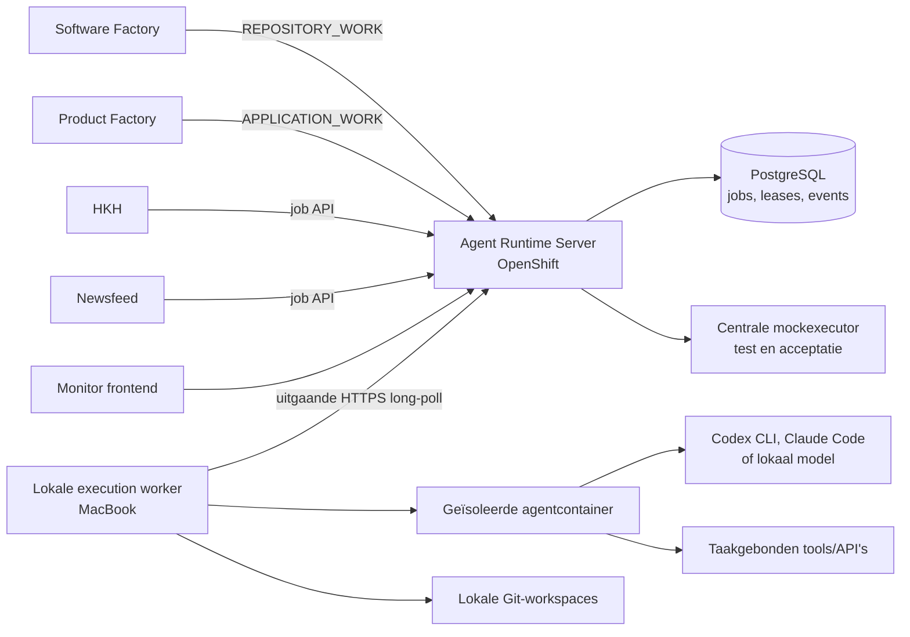

# Stappenplan gedeelde Agent Runtime

## Status en relatie tot andere plannen

Dit is een zelfstandig stappenplan voor een nieuwe gedeelde Agent Runtime. Product Factory en
Software Factory zijn de eerste twee beoogde consumenten en bepalen samen de twee externe
jobcontracten: applicatiewerk en repositorywerk. Hun domein- en orchestratieplannen blijven
zelfstandig; alleen de technische agentuitvoering wordt gedeeld.

De eerste platformrelease is in deze repository uitgevoerd: contracten, control plane, centrale
mock, lokale Codex/Claude-worker, versleuteld hersteljournal, repositorywerk, monitor, CI en beide
OpenShift-overlays zijn aanwezig. De fases voor het omschakelen van Product Factory, Software
Factory, Newsfeed en HKH blijven bewust migratiefases in hun eigen repositories; de Runtime-grens
waarop zij aansluiten is nu inzetbaar.

Na deze release is voor `APPLICATION_WORK` een eenvoudiger v2-contract besloten. Eén complete
`prompt` vervangt `instructions` plus `input`; domeincorrelatie en configuratieversies blijven bij
de consument; projectcredentials worden lokaal door workers ontdekt en alleen bij naam gevraagd;
kleine inputattachments worden Base64 aangeleverd; outputartifacts blijven bestanden; en iedere
attempt krijgt een harde deadline. [Vereenvoudigd APPLICATION_WORK-contract v2](application-work-v2.md)
is voor deze migratie leidend. De onderstaande v1-velden beschrijven de bestaande release en mogen
niet als doelcontract voor de Product Factory-aansluiting worden gebruikt.

Dit document is de enige bron voor deze roadmap. Het stond eerder tijdelijk in de Product Factory-repository (`docs/agent-runtime-stappenplan.md`); die kopie verwijst nu alleen nog hierheen.

## Referentiemateriaal in andere repositories

Deze repositories staan naast deze in `~/git/` en zijn de belangrijkste bronnen voor patronen en context. Lees er vrij in — er hoeft niets gewijzigd te worden om dit stappenplan te begrijpen of eraan te beginnen.

- **Software Factory** — `/Users/robbertvdzon/git/softwarefactory` (GitHub: `robbertvdzon/software-factory`). Robbert's bestaande autonome multi-agent pipeline (planner/developer/reviewer/tester-agents, georkestreerd door een factory-loop) die tracker-stories omzet in gemergde, gedeployde pull requests. Dit is de volwassen functionele referentie voor hoe agents nu al draaien, en de nieuwe runtime hergebruikt de architectuur en lessen daarvan, niet de codebase. Concreet relevant:
  - `Dockerfile.agent` en `runtime/docker/DockerAgentRuntime.kt` — één gedeeld agent-image met alle toolchains ingebakken (Playwright/Chromium voor browser-automation, Maven/Node/Flutter voor build/test, `oc`/`kubectl`, `psql`), en rol-gescopede credential-mounts (kubeconfig alleen voor tester/refiner, Docker-socket alleen voor build/testrollen).
  - `.factory/verification.yaml` en `verification/TesterVerificationRunner.kt` — het patroon van een deterministische, niet-AI verificatierunner die agent-geclaimde build/testcommando's zelf nogmaals uitvoert en Git-toestand vóór/na vergelijkt, zodat een agent nooit ongecontroleerd "getest" kan claimen.
  - `AgentWorkspace.kt` (`AGENT_ENV_DENYLIST`) — het huidige, bewust grovere denylist-model voor secrets; deze runtime kiest expliciet voor een allowlist per jobprofile in plaats daarvan (zie Beveiligingsgrenzen).
  - `tools/sf-browser` — voorbeeld van een losstaand browser-automation-script (Playwright, persistente context) dat als los bestand in de container gemount wordt.
  - Fase 3, 6 en 7 van dit stappenplan verwijzen expliciet naar deze patronen.
- **Product Factory** — `/Users/robbertvdzon/git/product-factory` (GitHub: `robbertvdzon/product-factory`). De eerste consument van applicatiewerk. Product Factory levert complete, opaque AI-verzoeken met eigen instructies, input, provider, model en resultaatschema. De runtime kent geen agentrollen, epics, stories of andere Product Factory-entiteiten.

## Aanleiding

Verschillende applicaties hebben dezelfde lokale voorzieningen nodig:

- AI-agents uitvoeren via accounts en abonnementen op de MacBook;
- taken ontvangen van applicaties die op OpenShift draaien;
- voor ontwikkeltaken repositories ophalen, branches maken en wijzigingen publiceren;
- voor applicatietaken veilig met beperkte applicatiegegevens werken;
- centraal kunnen zien wat draait, wacht, mislukt of voltooid is.

Wanneer iedere applicatie hiervoor een eigen worker bouwt, ontstaan meerdere implementaties voor authenticatie, wachtrijen, Git, containers, logging, retries en beveiliging. Daarom maken we hiervan één apart platform.

## Doel

Een generieke Agent Runtime maken waarmee geautoriseerde applicaties op OpenShift betrouwbare AI-taken kunnen aanbieden aan één of meer lokale workers, zonder de MacBook vanaf internet bereikbaar te maken.

De runtime ondersteunt vanaf het eerste versieerbare contract twee soorten werk:

1. **`APPLICATION_WORK`**: een complete, opaque AI-taak uitvoeren voor een aanvragende applicatie.
   De taak mag optioneel een publieke repository op een exacte commit-SHA lezen, maar schrijft nooit
   naar Git.
2. **`REPOSITORY_WORK`**: een gecontroleerde Git-workspace voorbereiden, een agent code of
   documenten laten wijzigen, valideren en het resultaat door de worker laten committen en
   publiceren.

De eerste bruikbare versie bewijst de volledige applicatiewerkroute voor Product Factory: één
OpenShift-server, een duurzame wachtrij, centrale mockuitvoering en één lokale worker voor Codex en
Claude. Repositorywerk volgt daar direct op voor Software Factory; beide jobsoorten delen hetzelfde
control plane, workerprotocol en operationele model.

## Niet het doel

- De Agent Runtime wordt geen Product Factory of Software Factory. Hij voert werk uit, maar bepaalt niet welk product gebouwd moet worden.
- De runtime bevat geen HKH-, Newsfeed- of Product Factory-domeinlogica.
- Applicaties krijgen geen mogelijkheid om willekeurige shellcommando's op de MacBook uit te voeren.
- AI-containers krijgen geen algemene GitHub-tokens, productiedatabasewachtwoorden of andere blijvende secrets.
- Een lokale abonnementsworker is geen gegarandeerd altijd-beschikbare infrastructuur voor directe eindgebruikersvragen.
- De bestaande workers worden pas verwijderd nadat hun vervanger aantoonbaar stabiel is.
- De runtime beheert geen prompts, agentrollen of modelinstellingen namens een consument. Een
  vertrouwde consument stelt een complete taak samen en blijft eigenaar van de domeinbetekenis.

## Uitgangspunten

- Een eigen repository en releasecyclus voor de Agent Runtime.
- Kotlin en Spring Boot/Spring Modulith voor de server, aansluitend op de bestaande architectuur.
- Een Kotlin-worker op macOS, zelfstandig te starten en via `launchd` op de achtergrond te draaien.
- Alle verbindingen worden vanaf de worker naar OpenShift opgebouwd via beveiligde HTTPS long-polling requests, aangevuld met een korte periodieke poll als vangnet. Er wordt geen inkomende poort op de MacBook geopend.
- Worker en server gebruiken geen WebSocket. Consumenten gebruiken eveneens gewone versieerbare
  HTTPS-requests voor aanvragen en queries; eventuele UI-liveweergave is geen workertransport.
- PostgreSQL is de bron voor jobs, statussen, leases, events en auditgegevens. Alleen de Agent Runtime Server heeft een databaseverbinding; de worker krijgt nooit rechtstreekse databasetoegang, ook niet wanneer de laptop zich in hetzelfde netwerk als OpenShift bevindt. Zo blijven autorisatie, contract en audit centraal bij de server.
- Applicaties communiceren met een versieerbaar HTTP-contract; ze delen geen interne runtime-code of database.
- Taken zijn asynchroon. Een applicatie maakt een job aan en leest later status en resultaat.
- Het control plane is engine- en providerneutraal. Codex CLI en Claude Code zijn gelijkwaardige adapters; later kunnen lokale modellen achter dezelfde interface worden toegevoegd.
- Een jobprofile bepaalt via een allowlist vooraf welke secrets, mounts en tools een job krijgt; er is geen standaardset die alleen door een denylist wordt beperkt. De aanvragende applicatie kan die grenzen niet tijdens de uitvoering verruimen.
- Een vertrouwde applicatie mag binnen haar jobprofile exact provider en model aanvragen. De runtime
  valideert die keuze en wacht zo nodig op een passende worker, maar vervangt haar niet stilzwijgend
  door een ander model.
- Alle jobsoorten draaien in hetzelfde brede, gedeelde execution-image met alle ondersteunde toolchains ingebakken (echte browser, build- en testtools, `oc`, databaseclients). Toegang wordt niet beperkt door tools uit het image weg te laten, maar door mounts en credentials per jobprofile te scopen.
- Secrets worden nooit onderdeel van prompts, jobpayloads, resultaten of ongeredigeerde logs.

## Beoogde architectuur



### Agent Runtime Server op OpenShift

De server is het control plane en is verantwoordelijk voor:

- authenticatie en autorisatie van aanvragende applicaties;
- valideren en duurzaam opslaan van jobs;
- prioriteiten, quota en eerlijke planning tussen applicaties;
- workerregistratie, capabilities en heartbeats;
- leases, time-outs, retries en annuleren;
- jobevents, geredigeerde logs, zichtbare agenttranscriptdelen, resultaten en artefactmetadata;
- deterministische mockuitvoering buiten productie;
- monitor-API en live statusupdates;
- audittrail van alle beslissingen en statusovergangen.

De server voert zelf geen echte AI- of Git-uitvoering uit. Alleen de centrale mockexecutor mag een
job zonder laptopworker afronden.

### Lokale execution worker

De worker is verantwoordelijk voor:

- zelf een uitgaande verbinding met de server onderhouden;
- alleen jobs accepteren waarvoor hij de juiste capability heeft;
- een geïsoleerde tijdelijke uitvoeromgeving voorbereiden;
- de gekozen AI-provider starten en bewaken;
- bij repositorywerk de volledige Git-lifecycle uitvoeren;
- toegestane validaties uitvoeren;
- voortgang, geredigeerde zichtbare agenttranscriptdelen, logs en resultaten terugmelden;
- bij herstart herkennen welke agentcontainers nog daadwerkelijk draaien en die aan de juiste job koppelen, zonder een taak dubbel uit te voeren;
- lokale tijdelijke gegevens gecontroleerd opruimen.

### Verantwoordelijkheidsgrens met consumenten

Een consument is eigenaar van de aanleiding, instructies, input, provider- en modelkeuze en de
domeinverwerking van het resultaat. Agent Runtime is de enige eigenaar van de technische jobqueue,
workerselectie, attempts, leases, heartbeats, fencing, technische retries, veilige voortgang en het
onveranderlijke technische resultaat.

Product Factory bouwt daarom geen eigen laptopworker of tweede technische AI-queue. Haar interne
AI-uitvoeringscapability is een clientfaçade: zij leest de eigen globale AI-instellingen, stelt het
complete verzoek samen, vraagt één Runtime-job aan en bewaart het Runtime-job-ID bij de wachtende
processessie of meeting. Een volgende procesrun leest status en resultaat via de Runtime-API. Alleen
Product Factory beslist daarna of de uitkomst een epic, story, bug, verificatie of overleguitkomst
mag worden.

Software Factory blijft eigenaar van haar ontwikkelorkestratie en stuurt per uitvoeringsstap een
`REPOSITORY_WORK`-job in. Alleen Agent Runtime beheert de tijdelijke workspace, agentcontainer en
Git-publicatie voor die job. Twee technische retrylagen voor dezelfde uitvoering zijn verboden:
een consument mag na een terminale Runtime-job bewust een nieuwe logische job aanvragen, maar
herstart nooit zelf een nog actieve of herstelbare Runtime-attempt.

### Monitor frontend

De monitor toont minimaal:

- online en offline workers en hun capabilities;
- actieve jobs met actuele stap, looptijd, worker en provider/model;
- de wachtrij met claimvolgorde en wachtreden;
- de laatste 30 afgeronde jobs per pagina, server-side zoeken en cursorpaginering;
- een jobdetail met schema-gevalideerd resultaat of veilige fout;
- het volledige beschikbare, geredigeerde zichtbare agenttranscript, ook live tijdens uitvoering.

Het transcript bevat geen verborgen chain-of-thought. Het bevat alleen de exacte prompt,
provider-zichtbare agenttekst, zichtbare toolaanroepen en geredigeerde tooluitvoer die de adapter
daadwerkelijk kan leveren. De beheerinterface biedt in de MVP geen annuleren, retry, mock- of
configuratieacties.

## Jobsoorten, configuratie en providers

De runtime heeft slechts twee fundamenteel verschillende jobsoorten. Productnamen, agentrollen en
domeinentiteiten komen niet in het runtimecontract voor.

### `APPLICATION_WORK`

- De aanvrager levert complete, versiegebonden instructies, alle benodigde input en eventueel een
  JSON-resultaatschema. Agent Runtime beheert geen applicatiespecifieke prompttemplates.
- De taak kan zonder tools draaien of vooraf toegestane browser-, web-, build-, test-,
  beeldgeneratie- of applicatietools gebruiken.
- Een optionele `RepositorySnapshot` bevat alleen een publieke HTTPS-Git-URL en een volledige,
  bevroren commit-SHA. De worker mag die checkout lezen en lokaal tijdelijk beschrijven voor analyse
  of tests, maar commit, pusht of publiceert nooit vanuit applicatiewerk.
- Taakgebonden omgevingstoegang gebruikt alleen vooraf toegestane routes en lokale
  secretreferenties. Plaintext secrets staan niet in het verzoek.
- Product Factory gebruikt uitsluitend deze jobsoort voor Productontwerp, Productplanning,
  Kwaliteitsbewaking en overlegagents.

### `REPOSITORY_WORK`

- De taak gebruikt één repository uit een server-side aliaslijst, nooit een vrije schrijf-URL.
- De worker maakt een tijdelijke branch met een voorgeschreven prefix en een gecontroleerde
  workspace.
- De agentcontainer krijgt de workspace maar geen GitHub-credentials.
- De worker verzorgt fetch, branch, validatie, commit, push en eventueel pull request.
- De repositoryalias bepaalt repository, basisbranch, toegestane paden, validaties en
  publicatiebeleid.
- Software Factory gebruikt deze jobsoort en blijft zelf eigenaar van storykeuze, agentrollen,
  werkvolgorde en beoordeling van het resultaat.

### Gemeenschappelijk aanvraagcontract

De volgende veldlijst beschrijft v1. Voor `APPLICATION_WORK` v2 vervallen `jobProfile`, `jobKey`,
`configurationVersion`, `instructionVersion`, `resourceRequests` en `consumerContext`; `instructions`
plus `input` worden één `prompt`. Zie het leidende [v2-contract](application-work-v2.md). V1 blijft
tijdens de migratie beschikbaar voor bestaande consumenten.

Het versieerbare OpenAPI-contract bevat voor beide jobsoorten minimaal:

```text
jobKind                   APPLICATION_WORK of REPOSITORY_WORK
idempotencyKey            uniek binnen de aanvragende applicatie
jobProfile                vooraf geregistreerde rechten en limieten
jobKey                    opaque applicatiesleutel voor correlatie en audit
provider                  CODEX, CLAUDE, MOCKED of latere toegestane provider
model                     exact aangevraagd model
configurationVersion      versie van de model-/providerkeuze bij de consument
instructionVersion        versie van de instructies bij de consument
instructions              complete vaste instructies
input                     opaque JSON-momentopname
responseSchema            optioneel JSON Schema
attachments               begrensde invoerreferenties met hash
repositorySnapshot        optioneel en read-only bij APPLICATION_WORK
repositoryRequest         verplicht bij REPOSITORY_WORK
resourceRequests          vooraf geregistreerde tool-, route- en secretRef-verzoeken
executionTimeout          aangevraagd binnen de profielgrens
maxAttempts               aangevraagd binnen de profielgrens
priority                   aangevraagd binnen de profielgrens
consumerContext            opaque product-, module-, sessie- of storycorrelatie zonder autoriteit
```

Tenant, applicatie-identiteit en toegestane jobprofielen volgen uit de geauthenticeerde
serviceaccount en worden nooit vertrouwd vanuit vrije payloadvelden. De runtime bewaart instructies
en input als opaque data en interpreteert geen `jobKey` of `consumerContext`. Een
`resourceRequest` verwijst alleen naar vooraf in het jobprofile toegestane resources; een payload
kan daarmee geen nieuw netwerkdoel, secret of tool introduceren. Resultaten bestaan uit één
schema-gevalideerde JSON-uitkomst en optionele begrensde, gehashte artifacts.

De consumenten-API bevat minimaal:

```text
POST /v1/jobs
GET  /v1/jobs/{jobId}
GET  /v1/jobs/{jobId}/result
GET  /v1/jobs/{jobId}/events
POST /v1/jobs/{jobId}/cancel
GET  /v1/jobs
```

Alle mutaties zijn idempotent waar een netwerkretry mogelijk is. Een consument leest alleen eigen
jobs; de monitor gebruikt een afzonderlijke beheerautorisatie.

### Artifacts

Screenshots, logs, traces, diffs en andere binaire resultaten staan nooit als Base64 in de
jobpayload. Een echte worker uploadt een artifact via de worker-API met MIME-type, grootte en
SHA-256-hash; een mockantwoord doorloopt dezelfde validatie. De server bewaart begrensde artifacts
voor de MVP als onveranderlijke BLOB en retourneert alleen artifact-ID's en metadata in het
jobresultaat. Eerste veilige limieten zijn 5 MB per artifact en 25 MB per job, begrensd aanpasbaar
per jobprofile. Een latere objectstore verandert het consumentencontract niet.

### Execution engines zijn geen jobsoort

Codex CLI, Claude Code en eventuele toekomstige lokale modellen zijn worker-engines achter dezelfde
jobsoorten. De enginekeuze verandert niet wat de taak functioneel mag doen.

- `codex-cli` gebruikt een lokaal geauthenticeerde Codex-installatie.
- `claude-code` gebruikt een lokaal geauthenticeerde Claude Code-installatie.
- `local-model` wordt later een adapter voor een lokaal model of lokale modelserver.
- Een cloud-API-adapter kan later als fallback worden toegevoegd voor tijdkritische of publieke interacties.
- Een worker meldt per verbinding welke engines, versies en capabilities op dat moment beschikbaar zijn.
- Een engine hoeft niet alle capabilities of modellen te ondersteunen.
- Een vertrouwde consument vraagt provider en model exact aan. De runtime controleert beide tegen
  serviceaccount, jobprofile, omgevingsbeleid en workercapabilities. Een niet-toegestane combinatie
  wordt geweigerd; een tijdelijk niet-beschikbare combinatie blijft zichtbaar wachten.
- Een latere expliciete fallbackpolicy mag meerdere toegestane combinaties bevatten, maar de
  runtime wisselt nooit stilzwijgend van provider of model.
- Engine-specifieke prompts, CLI-opties, authenticatie en outputvertaling blijven volledig binnen de adapter.
- Alle adapters leveren dezelfde genormaliseerde voortgang, eindstatus en gebruiksmetadata terug.

### Centrale mockexecutor

`MOCKED` is een server-side uitvoeringsroute en wordt nooit door een laptopworker geclaimd. Iedere
afnemer kan daardoor dezelfde echte jobopslag, API, schema-validatie en resultaatverwerking testen
zonder AI-kosten of een beschikbare laptop.

- Zowel `APPLICATION_WORK` als `REPOSITORY_WORK` kan worden gemockt. Een gemockte repositoryjob
  levert een voorbereid genormaliseerd Git-resultaat maar maakt geen workspace, commit, push of pull
  request.
- Mockantwoorden worden per tenant, applicatie, jobprofile en optionele `jobKey` en
  correlatiesleutel voorbereid; de meest specifieke match wint en gelijke matches zijn FIFO.
- Een antwoord kan succes, veilige fout, time-out, vertraging, crashsimulatie, ongeldige output en
  begrensde artifacts bevatten.
- Ontbreekt een passend antwoord, dan eindigt de job zichtbaar en niet-retrybaar met
  `NO_MOCK_RESPONSE_CONFIGURED`; er bestaat geen vriendelijke standaardrespons.
- Een mockjob maakt geen workerattempt, lease, heartbeat, fencing token of Dockercontainer.
- Integratie- en acceptatieomgevingen krijgen een beveiligde Test Control API voor voorbereiden,
  bekijken en resetten van mocks. Productie registreert die API niet en weigert `MOCKED`.
- Unit tests van consumenten mogen een kleine in-memory fake van de Runtime-client gebruiken;
  integratie- en acceptatietests gebruiken de echte server en centrale mockexecutor.

## Jobstatussen

Het publieke contract houdt de stabiele hoofdstatus klein:

1. `QUEUED`
2. `WAITING_FOR_WORKER`
3. `RUNNING`
4. `SUCCEEDED`
5. `FAILED`
6. `CANCELLED`

Een afzonderlijke actuele fase en de onveranderlijke jobevents geven meer detail, bijvoorbeeld
`LEASED`, `PREPARING`, `EXECUTING`, `VALIDATING`, `COMMITTING`, `PUSHING`, `RETRY_WAIT` en
`SUSPECTED`. Alleen repositorywerk gebruikt commit- en pushfasen. Consumenten hoeven hierdoor hun
domeinmodel niet aan iedere nieuwe interne runtimefase aan te passen.

## Repository-indeling

```text
agent-runtime/
├── pom.xml
├── agent-runtime-contracts/
├── agent-runtime-server/
├── agent-runtime-worker/
├── execution-images/
├── deploy/
├── docs/
└── .github/
```

- `agent-runtime-contracts`: OpenAPI- en JSON-schemabronnen; geen gedeelde domeinimplementatie.
- `agent-runtime-server`: Spring Modulith control plane en monitor-backend.
- `agent-runtime-worker`: lokale Kotlin-worker.
- De compacte beheerinterface is als statische webapp in de serverartifact opgenomen. Daardoor
  gebruikt monitor en API exact dezelfde route en release; zij kan later zonder contractwijziging
  worden afgesplitst.
- `execution-images`: gecontroleerde containerimages en versies voor agentuitvoering.
- `deploy`: OpenShift-resources, sealed secrets en migrations.
- `docs`: architectuurkeuzes, threat model, runbooks en dit stappenplan.

## Fase 0 — Besluiten en repositorybasis

### Resultaat

Een zelfstandige repository met een vastgelegd verantwoordelijkheidsgebied, basisbouw en belangrijke architectuurbesluiten.

### Werk

- Maven-multimodulebasis maken volgens de structuur van de Software Factory, zonder code te kopiëren.
- Spring Modulith-basis voor de server toevoegen.
- Kotlin command-linebasis voor de worker toevoegen.
- Een kleine responsive webbasis voor de monitor toevoegen.
- OpenAPI als bron voor het externe contract kiezen en vanaf het begin de gemeenschappelijke
  jobvelden plus `APPLICATION_WORK` en `REPOSITORY_WORK` vastleggen.
- Architectuurbesluiten vastleggen voor:
  - control plane versus execution plane;
  - asynchrone jobs;
  - PostgreSQL als duurzame opslag;
  - uitgaande workerverbinding;
  - provideradapters;
  - repositoryaliases en jobprofielen;
  - provider- en modelselectie door vertrouwde consumenten;
  - centrale mockuitvoering;
  - secrets en lokale credentials.
- Een threat model maken voor de MacBook, OpenShift, GitHub en applicatiegegevens.
- CI toevoegen voor Kotlin-tests, Modulith-verificatie, webassets, containers en contractvalidatie.
- De Agent Runtime als zelfstandig project aan de Software Factory toevoegen.

### Definition of Done

- De hele repository bouwt lokaal en in CI.
- Modules en afhankelijkheidsrichtingen zijn gedocumenteerd en automatisch gecontroleerd.
- Contractfixtures bewijzen dat een Product Factory-applicatiejob en een Software
  Factory-repositoryjob zonder domeinkennis valideerbaar zijn; echte koppelingen zijn nog niet nodig.
- De gekozen veiligheidsgrenzen zijn schriftelijk geaccepteerd voordat uitvoering van echte agents wordt toegevoegd.

## Fase 1 — Duurzaam control plane

### Resultaat

Een OpenShift-server die jobs betrouwbaar kan ontvangen, bewaren en volgen, nog zonder echte AI-worker.

### Werk

- Domeinmodules maken voor `jobs`, `workers`, `scheduling`, `tenants`, `audit` en `monitoring`.
- PostgreSQL-schema en Flyway-migrations toevoegen.
- API maken voor:
  - job indienen met idempotency key;
  - jobstatus, veilige voortgang, events en resultaat lezen;
  - job annuleren;
  - jobs per applicatie zoeken;
  - worker registreren en heartbeat verwerken;
  - lang-pollend de volgende beschikbare job claimen, met een korte time-out en een korte veilige
    poll als vangnet. Het transportcontract laat een latere database-notificatie-optimalisatie toe.
- Serviceaccount per aanvragende applicatie invoeren.
- Autorisatie op tenant, jobtype en jobprofiel toevoegen.
- Jobpayloads valideren tegen een versieerbaar schema.
- Aangevraagde provider, model, jobsoort en limieten valideren tegen serviceaccount en jobprofile.
- Een transactionele scheduler maken met prioriteit, `not-before` en capabilityselectie.
- Lease, lease-time-out en retrybeleid modelleren.
- Begrensde, gehashte artifactopslag en downloadautorisatie toevoegen; de MVP bewaart de inhoud als
  BLOB in PostgreSQL.
- De centrale mockexecutor en acceptance-only Test Control API implementeren. Mockjobs gebruiken
  dezelfde opslag en resultaatvalidatie, maar geen workerattempt.
- Een fake worker in integratietests gebruiken om de hele statusmachine te testen.
- OpenShift-deployment, service, route, databaseconfiguratie en sealed secrets toevoegen.
- Basis health-, readiness- en metrics-endpoints toevoegen.

### Belangrijke regels

- Aflevering is minimaal één keer; externe bijwerkingen moeten dus idempotent zijn.
- Een dubbele aanvraag met dezelfde idempotency key maakt geen tweede job.
- Een verlopen lease maakt een job pas opnieuw beschikbaar nadat de vorige uitvoering niet meer geldig kan afronden.
- De server slaat geen credentials voor lokale AI-abonnementen op.

### Definition of Done

- Een job blijft na server- of podherstart bestaan.
- Een voorbereide `MOCKED` applicatiejob kan zonder laptop schema-geldig slagen en alle ingestelde
  foutscenario's zijn deterministisch reproduceerbaar.
- Een voorbereide `MOCKED` repositoryjob levert zonder Git-bijwerking hetzelfde genormaliseerde
  repositoryresultaatcontract dat fase 6 later echt uitvoert.
- Een fake worker kan een job leasen, voortgang melden en afronden.
- Verbroken leases en retries zijn automatisch getest.
- Ongeautoriseerde applicaties kunnen geen jobs of resultaten van andere applicaties lezen.

## Fase 2 — Lokale worker en betrouwbare verbinding

### Resultaat

Een achtergrondworker op macOS die veilig verbinding maakt, een gecontroleerde testjob uitvoert en herstelt van netwerk- of procesuitval.

### Werk

- Workeridentiteit en roteerbaar token invoeren.
- Uitgaande HTTPS long-poll-loop toevoegen voor het claimen van nieuwe jobs, aangevuld met een korte
  periodieke poll als vangnet bij een gemiste of verbroken long-poll. Actieve attempts gebruiken
  afzonderlijke heartbeat- en voortgangscalls; het heartbeatantwoord kan annulering of fencing
  teruggeven.
- Capabilityregistratie en heartbeat implementeren.
- Heartbeat en veilige inhoudelijke voortgang scheiden: heartbeat bewijst alleen dat attempt en
  providerproces leven; voortgang bevat uitsluitend fase, optioneel percentage en een korte
  geredigeerde melding, nooit chain-of-thought of ruwe provideroutput.
- Naast voortgang een afzonderlijke duurzame transcriptstream toevoegen. Provideradapters leveren
  de exacte prompt en alle beschikbare zichtbare agenttekst, toolaanroepen en tooluitvoer als
  oplopende, idempotente delen aan; worker en server redigeren vóór opslag. Verborgen
  chain-of-thought is nooit onderdeel van dit contract.
- Lease ophalen, verlengen, voltooien en vrijgeven implementeren.
- Begrensde artifacts met MIME-type, grootte en SHA-256 uploaden voordat het eindresultaat wordt
  gemeld.
- Een lokale werkmap per job maken met veilige naamgeving en limieten.
- Logstreaming met redactiefilter en maximale omvang toevoegen.
- Annuleringssignalen verwerken.
- Crash recovery maken voor lokaal bekende actieve jobs. Iedere agentcontainer krijgt alleen labels
  met workerbootsessie, job-ID en attempt-ID; een lease- of fencing token staat nooit in een
  Dockerlabel. De worker bewaart het actuele fencing token versleuteld in een klein lokaal duurzaam
  journal en reconcilieert dat bij iedere start met `docker ps` en de server voordat hij nieuw werk
  claimt.
- Een `launchd`-configuratie en beheercommando's toevoegen voor starten, stoppen, status en logs.
- Schijfruimtebewaking en opruimbeleid voor oude jobs toevoegen.

### Definition of Done

- De worker start automatisch na inloggen of herstart van de MacBook.
- Bij een offline worker blijft een job veilig wachten.
- Na een verbroken verbinding hervat de worker zijn heartbeat en rapporteert hij de uitkomst zonder dubbele voltooiing.
- Na een herstart herkent de worker een nog draaiende agentcontainer aan job- en attempt-ID, maar
  hervat die alleen wanneer de server hetzelfde actuele attempt en fencing token bevestigt. Oude
  containers worden gestopt en hun resultaat wordt geweigerd.
- De server kan geen willekeurige commando's naar de worker sturen.

## Fase 3 — Applicatiewerk met Codex en Claude

### Resultaat

Een veilige `APPLICATION_WORK`-job kan via zowel de lokale Codex-installatie als Claude Code worden
uitgevoerd. Een optionele publieke repositorysnapshot blijft read-only en het resultaat voldoet bij
beide providers aan hetzelfde externe contract.

### Werk

- Een engine-interface definiëren voor beschikbaarheid, starten, volgen, annuleren en gebruiksmetadata.
- Adapter `codex-cli` toevoegen voor vertrouwde interne achtergrondtaken.
- Adapter `claude-code` toevoegen voor dezelfde jobcontracten en veiligheidsgrenzen.
- Engine-capabilities en geïnstalleerde versies door de worker laten publiceren.
- Per jobprofile een provider-, model-, tool-, netwerk- en credentialallowlist configureren.
- Een geïsoleerde credential-home per uitvoering gebruiken, gebaseerd op het volwassen patroon uit de Software Factory.
- De agent uitvoeren in één breed gedeeld, versieerbaar execution-image met alle ondersteunde toolchains ingebakken: een echte browser (Playwright/Chromium) voor testen, klikken en screenshots, build- en testtools voor de te ondersteunen ecosystemen, `oc`/`kubectl` en databaseclients — naar het bewezen patroon uit de Software Factory. Aanwezigheid van een tool in het image geeft op zichzelf geen enkele extra rechten; alleen de credentials en mounts die het jobprofile toestaat bepalen wat een specifieke job daadwerkelijk kan.
- Complete, versiegebonden instructies en opaque input van een geautoriseerde consument aan de
  container doorgeven zonder de domeinbetekenis te interpreteren.
- Optionele publieke HTTPS-repositories op exact de aangevraagde commit-SHA detached uitchecken,
  zonder Git-schrijftoken of publicatieroute.
- Browser, webonderzoek, builds, tests, begrensde artifacts en optionele beeldgeneratie als
  jobprofilecapabilities ondersteunen.
- Taakgebonden `secretRef`s alleen uit de lokale workerstore oplossen en nooit als plaintext naar de
  server, prompt, log of resultaat sturen.
- Maximale looptijd, outputomvang, aantal gelijktijdige jobs en dagquota instellen.
- JSON-resultaatschema afdwingen en een gecontroleerde reparatiepoging toestaan.
- Enginefouten onderscheiden van contract-, validatie- en infrastructuurfouten.
- Voor beide engines dezelfde end-to-end contracttest uitvoeren: indienen, wachten, uitvoeren en resultaat lezen.
- Vastleggen dat lokaal geauthenticeerde CLI-adapters alleen voor vertrouwde interne workloads worden gebruikt.

### Abonnement en API

- Lokale abonnementstoegang is geschikt voor interne coding-, research- en achtergrondjobs.
- Directe publieke gebruikersvragen mogen niet uitsluitend afhankelijk zijn van een slapende of offline MacBook.
- Voor zulke vragen volgt later eventueel een `openai-api`-provideradapter voor hetzelfde jobtype, of een expliciet asynchroon gebruikersmodel.
- Quota voorkomen dat bulkwerk van bijvoorbeeld Newsfeed alle capaciteit voor ontwikkelwerk gebruikt.

### Definition of Done

- Een vaste voorbeeldtaak levert consequent een schema-geldig resultaat.
- Credentials verschijnen niet in containerinspectie, prompts, logs of resultaten.
- Time-out en annuleren stoppen ook het onderliggende proces.
- Limieten van beide engines veroorzaken een herkenbare retry- of eindstatus.
- Dezelfde fixture kan zonder wijziging van het jobcontract door Codex CLI en Claude Code worden uitgevoerd.
- Een expliciet aangevraagde provider/modelcombinatie wordt gebruikt of zichtbaar geweigerd/wachtend
  gemaakt; de runtime wisselt niet stilzwijgend naar de andere engine.
- De container kan een publieke repositorysnapshot lezen maar niet committen, pushen of een pull
  request openen.

## Fase 4 — Minimale monitor en beheer

### Resultaat

De runtime is zonder database- of clusterinspectie operationeel te volgen.

### Werk

- Google-authenticatie voor beheerders toevoegen.
- Losse pagina's maken voor actieve jobs, wachtrij, de laatste 30 afgeronde jobs en workers.
- Afgeronde jobs server-side doorzoekbaar en met cursor-gebaseerde volgende/vorige pagina tonen.
- Jobdetail tonen met resultaat of veilige fout en het volledige beschikbare geredigeerde
  agenttranscript.
- Het transcript van een actieve job incrementeel bijwerken vanaf het laatst ontvangen
  sequence-nummer, zonder scrollpositie of reeds geladen tekst te verliezen.
- Prometheus-metrics en waarschuwingen toevoegen voor:
  - geen worker online;
  - oudste wachtende job;
  - vastgelopen lease;
  - snel oplopende foutpercentages;
  - bijna volle lokale werkopslag.
- Een runbook toevoegen voor veelvoorkomende storingen.

### Definition of Done

- Een beheerder kan de oorzaak van een vastgelopen voorbeeldjob vanuit de monitor achterhalen.
- Een beheerder kan het resultaat en volledige beschikbare transcript van een afgeronde job lezen.
- Een open detail van een actieve job ontvangt nieuwe transcriptdelen zonder duplicaten.
- Gevoelige payloadvelden en secrets worden nergens in de interface getoond.

## Fase 5 — Product Factory als eerste consument

### Resultaat

Alle echte AI-uitvoering van Product Factory loopt als `APPLICATION_WORK` via Agent Runtime. Er
wordt geen nieuwe Product Factory-specifieke laptopworker, technische AI-queue of leaseadministratie
gebouwd.

### Werk

- In Product Factory een dunne Agent Runtime-client achter de publieke AI-uitvoeringscapability
  plaatsen.
- De Product Factory-module haar globale `AiJobConfiguration` laten lezen en alleen provider, model,
  één complete prompt, resultaatschema, harde time-out, inputattachments, repositorysnapshot en
  afgeleide environmentkeynamen bevroren meesturen. Jobkey, configuratieversie,
  prompttemplateversie en domeincorrelatie blijven lokaal.
- Een lokale Product Factory-outbox plus Runtime-job-ID en idempotency key bij de wachtende
  processessie of meeting bewaren.
- Een volgende geplande of handmatige procesrun status en resultaat laten lezen zonder een thread of
  HTTP-call open te houden.
- Optionele publieke Gitcontext uitsluitend als URL plus volledige commit-SHA meesturen; er bestaat
  geen `product-factory-workspace` en geen Git-publicatie vanuit Product Factory-jobs.
- Product Factory-integratietests en acceptatie de centrale `MOCKED`-route en Test Control API laten
  gebruiken. Unit tests mogen de Runtime-client faken.
- De worker environmentkeynamen uit lokaal `project-credentials.env` laten registreren, de
  gefilterde catalogus aan Product Factory aanbieden en alleen jobs claimen waarvoor alle gevraagde
  namen beschikbaar zijn.
- Product Factory per product zelf bekende keys aan agentrollen laten koppelen; Runtime kent deze
  rollen niet en ontvangt nooit credentialwaarden.
- Kleine Base64-inputattachments materialiseren en outputbestanden automatisch als artifacts
  verzamelen.
- De harde attemptdeadline in server en worker afdwingen; lease, slaap en recovery verlengen haar
  nooit.
- Veilige jobstatus, voortgang, fout en artifacts in de bestaande Product Factory-operatieweergave
  projecteren; de gedeelde monitor blijft daarnaast beschikbaar voor technische diagnose.
- Vastleggen dat alleen Product Factory de schema-geldige AI-uitkomst inhoudelijk valideert en
  domeinobjecten publiceert.
- De oude v1-worker uitsluitend als historische referentie gebruiken; geen v2-compatibiliteitslaag,
  WebSocket of tijdelijke productspecifieke worker bouwen.

### Definition of Done

- Productontwerp, Productplanning, Kwaliteitsbewaking en overleg kunnen hetzelfde generieke
  Runtime-contract gebruiken zonder dat Agent Runtime hun rollen of entiteiten kent.
- Een centrale mockjob en een echte Codex- of Claude-job doorlopen vanuit Product Factory dezelfde
  asynchrone domeinflow.
- Product Factory beheert geen workercredential, attempt, lease, heartbeat of technische retry.
- Product Factory kan ontdekte environmentkeys aan rollen koppelen en een echte job ontvangt alleen
  de backend-side afgeleide subset; databases bevatten nooit de waarden.
- Een Runtime-fout laat de gekoppelde processessie zichtbaar wachten of blokkeren en veroorzaakt
  geen dubbele AI-uitvoering of dubbele domeinpublicatie.

## Fase 6 — Repository- en Git-uitvoering

### Resultaat

De runtime kan gecontroleerd `REPOSITORY_WORK` uitvoeren zonder Git-credentials aan de AI-agent te
geven.

### Git-lifecycle

1. De aanvrager gebruikt een repositoryalias, nooit een willekeurige schrijf-URL.
2. De worker haalt de repository op of actualiseert een lokale cache.
3. De worker maakt een schone workspace en unieke tijdelijke branch.
4. De agentcontainer krijgt alleen die workspace gemount.
5. De agent wijzigt bestanden zonder toegang tot GitHub-credentials.
6. De worker controleert gewijzigde paden, bestandsgrootten en verboden inhoud.
7. De worker voert de vooraf geconfigureerde validaties uit.
8. De worker commit met job-ID en auditmetadata.
9. De worker pusht en maakt volgens het profiel eventueel een pull request.
10. De job levert branch, commit-SHA, diffstatistieken, testresultaten en pull-request-URL terug.

### Werk

- Repositoryaliasconfiguratie en lokale Git-credentials per alias toevoegen.
- Branchbeleid, toegestane basisbranches en padallowlists toevoegen.
- Lokale clone-cache en geïsoleerde worktrees maken.
- Commit- en push-idempotentie ontwerpen met job-ID-marker.
- Alleen vooraf geregistreerde validatiecommando's toestaan.
- Voor profielen die dat vereisen een deterministische, niet-AI verificatierunner toevoegen die
  validaties herhaalt en de Git-toestand vóór en na vergelijkt.
- Geheime bestanden, grote binaries en onverwachte symlinks blokkeren.
- Een handmatige goedkeuringsgrens ondersteunen vóór push of pull request.
- Opruimen van worktree en container na succes, fout of annulering testen.

### Definition of Done

- Een testrepository kan end-to-end worden gewijzigd, gevalideerd, gecommit en gepusht.
- De agentcontainer kan de GitHub-token niet lezen.
- Een niet-toegestaan pad of commando stopt de job vóór publicatie.
- Een technische retry leidt niet tot dubbele commits of pull requests.
- `APPLICATION_WORK` blijft ongewijzigd werken en krijgt nooit per ongeluk Git-schrijfrechten.

## Fase 7 — Software Factory als repositoryconsument

### Resultaat

Software Factory gebruikt `REPOSITORY_WORK` voor lokale agent-, container- en Git-uitvoering,
terwijl haar bestaande story- en rolorkestratie buiten Agent Runtime blijft.

### Veilige volgorde

1. Het bestaande Software Factory-proces als referentie en acceptatietest vastleggen.
2. De gemeenschappelijke jobvelden en repositoryuitkomst aan de Software Factory-client koppelen.
3. Alleen tegen een speciale testrepository shadowjobs zonder productiebijwerkingen uitvoeren.
4. Workspacevoorbereiding, Dockeruitvoering, validatie, commit, push en cleanup vergelijken.
5. Eén niet-kritieke uitvoeringsstap via feature flag migreren.
6. Geleidelijk uitbreiden met meetbare fout- en terugvalgrenzen.
7. De oude lokale uitvoerroute tijdelijk beschikbaar houden, maar nooit dezelfde schrijvende job
   gelijktijdig via oud en nieuw uitvoeren.
8. Pas na stabiliteit eventueel de Software Factory-orchestrator naar OpenShift verplaatsen.
9. De oude lokale Factory-runtime verwijderen nadat rollback niet meer nodig is.

### Extra aandacht

- Testcontainers hebben mogelijk Docker-toegang nodig. Dat wordt een expliciet hoog-risicoprofiel en
  geen standaardcapability.
- De voorkeur gaat uit naar een geïsoleerde rootless- of DinD-oplossing; een algemene
  Docker-socketmount wordt niet de standaard.
- De bestaande Software Factory is de volwassen functionele referentie, maar de nieuwe runtime
  hergebruikt architectuur en lessen, niet de codebase.

### Definition of Done

- Dezelfde teststory levert functioneel gelijkwaardig Git-resultaat op.
- Fouten, annulering en cleanup zijn minstens even betrouwbaar als in de bestaande Factory.
- De lokale MacBook draait alleen nog de gedeelde execution worker en noodzakelijke provider- en
  Git-voorzieningen.
- Product Factory-applicatiewerk en Software Factory-repositorywerk kunnen naast elkaar door
  dezelfde server en worker worden gepland zonder elkaars rechten te erven.

## Fase 8 — Newsfeed als applicatieconsument

### Resultaat

Een niet-kritieke asynchrone Newsfeed-AI-taak draait als `APPLICATION_WORK` met alleen de benodigde
Newsfeed-tools.

### Werk

- Een geschikte achtergrondtaak kiezen, bijvoorbeeld verrijking of samenvatting die opnieuw
  uitgevoerd kan worden.
- Een taakgebonden Newsfeed-API aanbieden in plaats van databasecredentials.
- Per job een kortlevend, beperkt token uitgeven.
- Prioriteit en dagquota lager instellen dan interactief of ontwikkelwerk.
- Kosten, wachttijd, kwaliteit en abonnementsverbruik vergelijken met de huidige API-route.
- API-fallback behouden voor tijdkritische taken.

### Definition of Done

- De worker heeft geen rechtstreekse toegang tot de Newsfeed-database.
- Offline zijn van de MacBook beschadigt geen Newsfeed-proces.
- Op basis van gemeten kosten en betrouwbaarheid is per jobKey vastgelegd welke providerroute wordt
  gebruikt.

## Fase 9 — HKH als applicatieconsument

### Resultaat

HKH kan `APPLICATION_WORK` gebruiken zonder Git- of algemene database-toegang te geven.

### Werk

- Eerst één laag-risico achtergrondtaak kiezen, los van directe gebruikersvragen.
- Een beperkte HKH-tool/API ontwerpen voor uitsluitend de benodigde historische gegevens.
- Bronverwijzingen en provenance verplicht onderdeel van het resultaat maken.
- Persoonsgegevens en auteursrechtelijk materiaal classificeren vóór verzending naar een provider.
- Jobresultaten eerst als voorstel opslaan; publicatie blijft een afzonderlijke domeinactie.
- Voor interactieve vragen kiezen tussen asynchroon antwoord, cloud-API-fallback of een hybride
  route op basis van beschikbaarheid en budget.

### Definition of Done

- Een agent kan alleen de expliciet aangeboden HKH-tools aanroepen.
- Resultaten zijn herleidbaar tot gebruikte bronnen en jobversie.
- Geen agentresultaat wordt ongemerkt als historisch feit gepubliceerd.

## Fase 10 — Productierijp maken

### Resultaat

De Agent Runtime is beheersbaar, herstelbaar en uitbreidbaar naar meerdere workers en providers.

### Werk

- Meerdere workers en capability-based routing ondersteunen.
- Per applicatie fair scheduling, concurrency en budgetten instellen.
- Adapter `local-model` toevoegen zodra een geschikt lokaal model of modelserver is gekozen.
- Adapter `openai-api` of een andere cloudprovider toevoegen voor expliciete fallbackprofielen.
- Expliciete fallbackpolicies toevoegen zonder de bestaande regel te breken dat een consument exact
  weet welke provider en welk model een job gebruikt.
- Databaseback-up en herstelprocedure implementeren en periodiek testen.
- Audit- en jobretentie instelbaar maken; grote artefacten buiten PostgreSQL opslaan.
- Contractcompatibiliteit en migratiebeleid publiceren.
- Worker- en execution-image-upgrades gecontroleerd uitrollen.
- Securityreview en periodieke credentialrotatie invoeren.
- Disaster-recoveryoefening uitvoeren voor server, database en verlies van een lokale worker.
- Capaciteitsmetingen en kostenrapportage per applicatie toevoegen.

### Definition of Done

- Een tweede worker kan zonder applicatiewijziging jobs overnemen.
- Databaseherstel en tokenrotatie zijn aantoonbaar geoefend.
- Per applicatie zijn beschikbaarheid, wachttijd en kosten zichtbaar.
- Een defecte engine- of provideradapter beïnvloedt andere engines en profielen niet.

## Eerste uitvoerbare stories

Deze stories vormen de kleinste nuttige verticale doorsnede voor centraal applicatiewerk en bereiden
repositorywerk direct voor.

1. Maak de zelfstandige repository en multimodulebouw.
2. Leg het gemeenschappelijke jobcontract v1 plus `APPLICATION_WORK` en `REPOSITORY_WORK`, de
   statusmachine en idempotencyregels vast.
3. Sla een job met Flyway en PostgreSQL duurzaam op.
4. Bouw de beveiligde consumenten-API om jobs in te dienen, te volgen, te annuleren en resultaten te
   lezen.
5. Bouw de centrale mockexecutor, mockfixtures en acceptance-only Test Control API.
6. Laat een technische fake worker een lease verkrijgen, veilige voortgang melden en een job
   voltooien.
7. Bouw de lokale worker met uitgaande HTTPS long-polling, heartbeat, fencingjournal en
   reconciliatie.
8. Voeg de geïsoleerde `codex-cli`-adapter toe.
9. Voeg de geïsoleerde `claude-code`-adapter toe.
10. Voer dezelfde `APPLICATION_WORK`-fixture via mock, Codex en Claude uit met hetzelfde
    JSON-resultaatcontract.
11. Test offline worker, slaap, server- en workerherstart, leaseverlies, fencing, annuleren, dubbele
    aanvraag en uitgeputte retries.
12. Koppel één Product Factory-jobKey en daarna alle Product Factory-AI-jobs.
13. Toon workerstatus en jobtijdlijn in de minimale monitor.
14. Implementeer `REPOSITORY_WORK`, repositoryaliases, validatie en idempotente Git-publicatie.
15. Koppel één Software Factory-uitvoeringsstap en breid die na de pilot gecontroleerd uit.

Na story 12 bestaat de applicatiewerk-MVP en heeft Product Factory geen eigen laptopworker nodig.
Na story 15 ondersteunt dezelfde runtime ook Software Factory. Lokale modellen, Newsfeed en HKH zijn
vervolgstappen.

## Prioriteiten en quota

Een eerste beleidsvoorstel:

1. Storingsherstel en expliciet handmatig werk.
2. Software Factory-ontwikkeljobs.
3. Product Factory-onderzoek en productwerk.
4. HKH-achtergrondverwerking.
5. Newsfeed-bulkverwerking.

Per applicatie komen minimaal limieten voor gelijktijdige jobs, maximale looptijd, jobs per dag en maximale output. Ongebruikte lage-prioriteitscapaciteit mag worden benut, maar bulkjobs mogen hogere prioriteiten niet blokkeren.

## Beveiligingsgrenzen

- Iedere applicatie krijgt een eigen serviceaccount en server-side policy. V1 gebruikt toegestane
  profielen; `APPLICATION_WORK` v2 leidt rechten af zonder vrij `jobProfile`-veld.
- Iedere worker heeft een eigen roteerbare identiteit.
- Provider, model en opgegeven limieten worden altijd tegen serviceaccount en serverpolicy
  gevalideerd; payloadvelden verlenen zelf geen rechten.
- V1-jobprofielen blijven geldig tijdens migratie. `APPLICATION_WORK` v2 gebruikt een vaste toolset
  per consument en selecteert alleen geregistreerde environmentkeynamen uit zichtbare
  projectprefixes. `REPOSITORY_WORK` behoudt zijn strengere repositoryprofielen.
- Repository's worden via aliases en allowlists geselecteerd.
- Een `APPLICATION_WORK`-repositorysnapshot mag alleen een toegestane publieke HTTPS-URL en exacte
  commit-SHA bevatten en heeft nooit een schrijfcredential.
- Branchprefix, basisbranch, toegestane paden en validaties horen bij het profiel.
- De agent krijgt geen GitHub-credential; de worker voert Git-publicatie uit.
- Applicatieagents krijgen alleen de door de consumentrol geselecteerde lokale credentialsubset.
  Voor deze persoonlijke projecten kunnen daarin bewust database-URL's of testaccounts staan; het
  volledige bronbestand en Runtime-/providercredentials blijven buiten de container.
- Execution images staan op een allowlist en zijn met versie of digest vastgezet.
- Vrije shellcommando's in een jobpayload zijn verboden.
- Prompt, log, result en foutdetails gaan door redactieregels en groottelimieten.
- Complete consumentinstructies worden als vaste instructie behandeld; repository-, story-,
  meeting- en webinhoud blijft onvertrouwde data en kan het jobprofile niet verruimen.
- Productie weigert `MOCKED` en registreert geen Test Control API.
- Docker-toegang is standaard afwezig en alleen beschikbaar in een apart risicoprofiel.
- Publieke of onbetrouwbare input wordt nooit rechtstreeks een instructie voor Codex CLI, Claude Code of een lokaal model met lokale systeemtoegang.

## Betrouwbaarheid en herstel

- De server gebruikt PostgreSQL als waarheid; long-poll-berichten zijn alleen transport.
- Iedere job heeft een idempotency key vanuit de aanvrager.
- Iedere echte uitvoeringspoging heeft een attempt-ID en een eenmalig fencing token. De server
  bewaart alleen de tokenhash; de worker bewaart het actuele token versleuteld in zijn journal.
- Als eerste veilige standaard stuurt de worker iedere 30 seconden heartbeat, verloopt de lease na
  2 minuten en volgt daarna 30 minuten hersteltermijn voordat een nieuwe poging mag starten. Deze
  waarden zijn per profiel begrensd configureerbaar.
- Een gemiste heartbeat maakt een poging eerst `SUSPECTED`. Herstelt dezelfde worker binnen de
  hersteltermijn, dan hervat hij hetzelfde attempt; een nieuwere of gefencete poging kan nooit meer
  afronden.
- De server accepteert voortgang en eindresultaat alleen met job-ID, attempt-ID en geldig fencing
  token.
- Iedere echte attempt heeft daarnaast een bij claimen bevroren harde deadline. Server en worker
  dwingen haar onafhankelijk af; heartbeat, slaap, lease en recovery kunnen haar niet verlengen en
  ieder laat bericht wordt gefencet.
- Retries krijgen een maximum en een expliciete back-off.
- Git- en publicatiebijwerkingen gebruiken job-ID's om dubbele acties te herkennen.
- Een worker reconcilieert journal en Dockercontainers vóór hij nieuwe jobs claimt. Dockerlabels
  bevatten nooit tokens of andere secrets.
- Onvolledige workspaces worden in quarantaine gezet of gecontroleerd opgeruimd.
- Een dead-letter- of definitief mislukte status vereist zichtbare diagnose, geen eindeloze retry.
- Alleen Agent Runtime voert technische retries van een attempt uit. Een consument mag pas na een
  terminale job bewust een nieuwe logische job aanvragen.
- `MOCKED` gebruikt dezelfde duurzame job en resultaatvalidatie maar geen attempt, lease of
  heartbeat.

## Uitrol- en rollbackstrategie

- Iedere bestaande consument krijgt een feature flag per jobKey of uitvoeringsstap.
- Nieuwe routes beginnen met fixturejobs en daarna shadow jobs tegen niet-productiedata.
- Oud en nieuw mogen tijdelijk naast elkaar bestaan, maar nooit dezelfde side-effectjob gelijktijdig uitvoeren.
- Migratiecriteria worden vooraf meetbaar gemaakt: succespercentage, dubbele uitvoering, wachttijd, kosten en handmatige interventies.
- Bij overschrijding van een foutgrens gaat het jobtype terug naar de oude route.
- Database- en contractmigraties blijven achterwaarts compatibel zolang een rollbackversie ondersteund wordt.
- Bestaande workers en credentials worden pas verwijderd na een afgesproken stabiliteitsperiode.
- Product Factory v2 bouwt geen tijdelijke eigen worker: acceptatie gebruikt eerst de centrale mock
  en echte AI-uitvoering wordt actief zodra de applicatiewerkroute en gedeelde worker gereed zijn.

## Beslismomenten voor de eigenaar

Deze keuzes hoeven de eerste technische stories niet allemaal te blokkeren, maar zijn vóór de genoemde fase nodig:

- Definitieve OpenShift-hostnaam en namespace — vóór fase 1-deployment.
- Google OAuth-client en toegestane beheerders — vóór fase 4.
- Welke repositories en GitHub-identiteiten toegestaan zijn — vóór fase 6.
- Of pull requests automatisch of pas na menselijke goedkeuring worden geopend — vóór de eerste echte repositorypilot.
- Welke Newsfeed- en HKH-data een lokale of externe provider mag verwerken — vóór fase 8 en 9.
- Of directe gebruikersvragen een betaalde API-fallback krijgen — vóór interactieve inzet.
- Of de MacBook voldoende beschikbaar is of later een aparte altijd-aan worker nodig is — vóór het afspreken van beschikbaarheidsdoelen.

## Vervolgkeuzes

- Wanneer wordt de huidige ingebedde webmonitor groot genoeg om als zelfstandige frontend te
  worden afgesplitst?
- Worden jobevents alleen als relationele auditrecords opgeslagen of als volledige event-sourced aggregate?
- Welke objectopslag gebruiken we later voor grote logs, diffs en artefacten?
- Hoe worden taakgebonden applicatietools technisch aangeboden: HTTP, MCP of beide?
- Welke execution-profielen hebben werkelijk Docker-in-Docker nodig?
- Welke cloudprovideradapter is de eerste fallback naast de lokale Codex- en Claude Code-installaties?
- Welke lokale modelserver en welk model worden als eerste door `local-model` ondersteund?
- Wanneer is een tweede worker nuttiger dan verdere beschikbaarheidslogica rond één MacBook?

Deze vragen worden als expliciete architectuurbesluiten behandeld. Ze worden niet impliciet opgelost in losse implementatiestories.

## Eindbeeld

Na afronding draait op OpenShift één duurzaam en observeerbaar control plane. Product Factory dient
complete `APPLICATION_WORK`-jobs in en Software Factory gecontroleerde `REPOSITORY_WORK`-jobs. De
centrale mockexecutor maakt dezelfde contracten testbaar zonder laptop; de MacBook of een andere
execution host haalt echte jobs via uitgaande HTTPS-long-polling op en meldt heartbeat, veilige
voortgang en resultaat terug. Alle consumenten houden hun eigen domein- en ontwikkelorkestratie. De
gedeelde runtime doet uitsluitend veilige, betrouwbare technische uitvoering.
