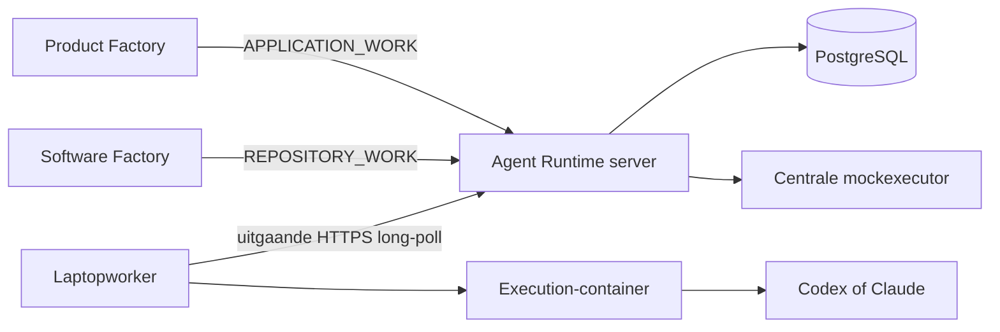

# Architectuur en beveiliging

Voor `APPLICATION_WORK` geldt aanvullend het doelontwerp
[Vereenvoudigd APPLICATION_WORK-contract](application-work.md). Het contract houdt Runtime- en
providercredentials buiten de agentcontainer, maar maakt een bewust
geselecteerde subset uit lokaal `project-credentials.env` wel leesbaar voor de agent. Dit is voor
deze persoonlijke projecten een expliciet geaccepteerde risicoafweging en geen algemene veilige
standaard voor multitenant- of bedrijfscredentials.

## Grens van het platform

Agent Runtime kent alleen technische uitvoering. `APPLICATION_WORK` bevat één complete opaque
prompt; `REPOSITORY_WORK` voegt een vooraf bekende repositoryalias toe. Productnamen, rollen,
epics, stories en bugs hebben voor dit platform geen betekenis.

De server is de enige eigenaar van queue, status, attempts, leases, retries, events, geredigeerde
transcriptdelen en resultaten. Een consument verwerkt alleen een terminale, schema-geldige
technische uitkomst naar zijn eigen domein. De worker kent geen consumentendatabase en de server
bewaart geen lokale AI-credentials.

## Maven- en Modulithgrenzen

- `agent-runtime-contracts` bevat uitsluitend de versieerbare externe gegevensvormen en OpenAPI.
- `agent-runtime-server` is de composition root. De packages `jobs`, `workers`, `mock` en `monitor`
  zijn acyclische Modulithmodules; dit wordt in CI met ArchUnit geverifieerd.
- `agent-runtime-worker` is een zelfstandig proces en praat alleen via HTTPS.

## Authenticatie en autorisatie

Vier onafhankelijke bearercredentials bestaan in productie:

| Credential | Mag |
|---|---|
| `AR_PRODUCT_FACTORY_TOKEN` | Alleen eigen `APPLICATION_WORK` maken en lezen |
| `AR_SOFTWARE_FACTORY_TOKEN` | Alleen eigen `REPOSITORY_WORK` maken en lezen |
| `AR_WORKER_TOKEN` | Worker registreren en actuele attempts bedienen |
| `AR_ADMIN_TOKEN` | Alle veilige metadata bekijken, terminal werk opnieuw aanbieden en mocks in acceptatie beheren |

Tenant en rechten volgen uitsluitend uit het token. Payloadvelden kunnen nooit meer rechten geven.
Er gelden vaste serverpolicies plus de voor de consument zichtbare projectprefixes. Een ongeldig
token, environmentkey, repositoryalias, provider of werksoort faalt vóór uitvoering. Productie
weigert `MOCKED` en stelt de Test Control API niet bruikbaar beschikbaar.

## Secrets

Het secretproces volgt dezelfde regels als Product Factory:

- prioriteit lokaal: `properties.default.env`, genegeerd `properties.env`, genegeerd `secrets.env`,
  daarna procesenvironment;
- productie leest waarden uit één OpenShift Secret dat alleen als SealedSecret in Git staat;
- secretwaarden komen nooit in prompts, payloads, foutmeldingen, Dockerlabels of logs;
- `deploy/seal-secrets.sh` gebruikt alleen bestanden met mode `0600`, `mktemp` en een cleanuptrap;
- `deploy/initialize-secrets.sh` kan de bestaande servicetokens zonder weergave overnemen en
  genereert onafhankelijke ontbrekende waarden;
- een productieproces start niet met lege, korte of lokale standaardtokens.

De lokale worker scheidt deze Runtime-secrets van
`project-credentials.env`. Alleen namen uit dat tweede, eveneens gitignored en met `0600`
beschermde bestand worden geregistreerd. Een job bevat uitsluitend namen; de worker maakt per
attempt een tijdelijke subset. Het bronbestand zelf en alle `AR_*`-, provider- en
Git-publicatiecredentials worden nooit gemount.

## Execution-containers

Het brede image bevat Codex, Claude, Git, Java/Maven, Node, Playwright/Chromium, `oc`/`kubectl` en
PostgreSQL-tools. Aanwezigheid van tooling verleent geen autoriteit. Er geldt een vaste serverpolicy
per consument en de job selecteert alleen geregistreerde environmentkeynamen. De worker materialiseert
daarvan een tijdelijke, read-only `secrets.env`; het volledige lokale bronbestand wordt nooit
gemount.

De agentcontainer krijgt nooit het GitHub-token waarmee de worker publiceert. Bij
`APPLICATION_WORK` verwijdert de worker zelfs de remote na een detached checkout. Bij
`REPOSITORY_WORK` controleert de worker symlinks, geheime bestandsnamen en grote bestanden voordat
hij commit en publiceert.

## Betrouwbaarheid

- Iedere consumentenaanvraag heeft een unieke idempotency key per tenant.
- Iedere echte poging heeft een willekeurig fencing token; alleen de SHA-256-hash staat in de
  database.
- Heartbeat verlengt standaard iedere 30 seconden een lease van twee minuten.
- Na leaseverlies volgt eerst een herstelvenster van dertig minuten (`SUSPECTED`). Pas daarna wordt
  een poging verlaten en met 30, 60, 120 seconden enzovoort opnieuw aangeboden, maximaal 30 minuten
  en nooit boven de server-side attemptlimiet.
- Resultaat, artifacts en progress worden alleen geaccepteerd voor het actuele attempt.
- Transcriptdelen worden alleen voor de actuele gefencete attempt geaccepteerd, zijn idempotent op
  deel-ID en sequence-nummer en worden vóór opslag geredigeerd.
- Artifacts zijn per stuk maximaal 5 MB en per job 25 MB, met verplichte SHA-256-controle.
- Events en transcriptdelen zijn append-only; het resultaat van een geslaagde job verandert niet
  meer.

## Threatmodel in het kort

| Dreiging | Begrenzing |
|---|---|
| Gestolen consumenttoken | Tenant- en serverpolicyscope; token apart roteerbaar |
| Promptinjectie uit Git, web of input | Externe inhoud expliciet onvertrouwd; kan serverpolicy nooit verruimen |
| Oude worker voltooit na retry | Attempt-ID plus fencing token; oude token wordt geweigerd |
| Laptop slaapt tijdelijk | Lease wordt eerst `SUSPECTED`; ruim herstelvenster voorkomt dubbel werk |
| Agent probeert Gitcredential te lezen | Credential blijft buiten container; publicatie door worker |
| Secret in log of fout | Redactie, maximale lengte en veilige generieke serverfouten |
| Secret in zichtbaar agenttranscript | Redactie in de worker en opnieuw op de server vóór duurzame opslag |
| Verborgen modelredenering wordt als transcript verwacht | Alleen provider-zichtbare tekst en toolgebeurtenissen opslaan; niets reconstrueren |
| Mock per ongeluk in productie | Startupomgeving en aanvraagvalidatie weigeren `MOCKED` |
| Databaseverlies | Dagelijkse custom-format backup, hash, retentie en restorecontrole |
