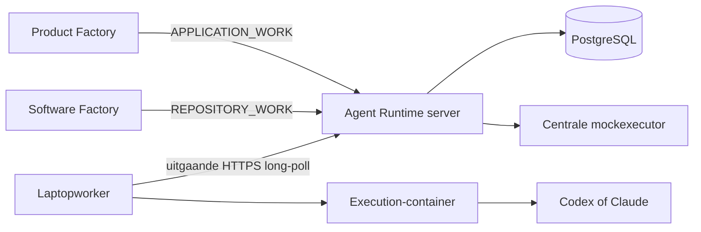

# Architectuur en beveiliging

## Grens van het platform

Agent Runtime kent alleen technische uitvoering. `APPLICATION_WORK` bevat opaque instructies en
input; `REPOSITORY_WORK` voegt een vooraf bekende repositoryalias toe. Productnamen, rollen,
epics, stories en bugs hebben voor dit platform geen betekenis.

De server is de enige eigenaar van queue, status, attempts, leases, retries, events en resultaten.
Een consument verwerkt alleen een terminale, schema-geldige technische uitkomst naar zijn eigen
domein. De worker kent geen consumentendatabase en de server bewaart geen lokale AI-credentials.

## Maven- en Modulithgrenzen

- `agent-runtime-contracts` bevat uitsluitend de versieerbare externe gegevensvormen en OpenAPI.
- `agent-runtime-server` is de composition root. De packages `jobs`, `workers`, `mock` en `monitor`
  zijn acyclische Modulithmodules; dit wordt in CI met ArchUnit geverifieerd.
- `agent-runtime-worker` is een zelfstandig proces en praat alleen via HTTPS.

## Authenticatie en autorisatie

Vier onafhankelijke bearercredentials bestaan in productie:

| Credential | Mag |
|---|---|
| `AR_PRODUCT_FACTORY_TOKEN` | Alleen eigen `APPLICATION_WORK` maken en lezen |
| `AR_SOFTWARE_FACTORY_TOKEN` | Alleen eigen `REPOSITORY_WORK` maken en lezen |
| `AR_WORKER_TOKEN` | Worker registreren en actuele attempts bedienen |
| `AR_ADMIN_TOKEN` | Alle veilige metadata bekijken, terminal werk opnieuw aanbieden en mocks in acceptatie beheren |

Tenant en rechten volgen uitsluitend uit het token. Payloadvelden kunnen nooit meer rechten geven.
Een ongeldig token, profiel, resource, repositoryalias, provider of werksoort faalt vóór opslag of
uitvoering. Productie weigert `MOCKED` en stelt de Test Control API niet bruikbaar beschikbaar.

## Secrets

Het secretproces volgt dezelfde regels als Product Factory:

- prioriteit lokaal: `properties.default.env`, genegeerd `properties.env`, genegeerd `secrets.env`,
  daarna procesenvironment;
- productie leest waarden uit één OpenShift Secret dat alleen als SealedSecret in Git staat;
- secretwaarden komen nooit in prompts, payloads, foutmeldingen, Dockerlabels of logs;
- `deploy/seal-secrets.sh` gebruikt alleen bestanden met mode `0600`, `mktemp` en een cleanuptrap;
- `deploy/initialize-secrets.sh` kan de bestaande v1-servicetokens zonder weergave overnemen en
  genereert onafhankelijke ontbrekende waarden;
- een productieproces start niet met lege, korte of lokale standaardtokens.

## Execution-containers

Het brede image bevat Codex, Claude, Git, Java/Maven, Node, Playwright/Chromium, `oc`/`kubectl` en
PostgreSQL-tools. Aanwezigheid van tooling verleent geen autoriteit. Het jobprofiel bepaalt welke
resourcekeys zijn toegestaan; credentials worden vanaf de worker als read-only bron gemount en
binnen de tijdelijke containerhome gekopieerd.

De agentcontainer krijgt nooit het GitHub-token waarmee de worker publiceert. Bij
`APPLICATION_WORK` verwijdert de worker zelfs de remote na een detached checkout. Bij
`REPOSITORY_WORK` controleert de worker symlinks, geheime bestandsnamen en grote bestanden voordat
hij commit en publiceert.

## Betrouwbaarheid

- Iedere consumentenaanvraag heeft een unieke idempotency key per tenant.
- Iedere echte poging heeft een willekeurig fencing token; alleen de SHA-256-hash staat in de
  database.
- Heartbeat verlengt standaard iedere 30 seconden een lease van twee minuten.
- Na leaseverlies volgt eerst een herstelvenster van dertig minuten (`SUSPECTED`). Pas daarna wordt
  een poging verlaten en met 30, 60, 120 seconden enzovoort opnieuw aangeboden, maximaal 30 minuten
  en nooit boven `maxAttempts`.
- Resultaat, artifacts en progress worden alleen geaccepteerd voor het actuele attempt.
- Artifacts zijn per stuk maximaal 5 MB en per job 25 MB, met verplichte SHA-256-controle.
- Events zijn append-only; het resultaat van een geslaagde job verandert niet meer.

## Threatmodel in het kort

| Dreiging | Begrenzing |
|---|---|
| Gestolen consumenttoken | Tenant- en profielscope; token apart roteerbaar |
| Promptinjectie uit Git, web of input | Input expliciet onvertrouwd; kan profiel nooit verruimen |
| Oude worker voltooit na retry | Attempt-ID plus fencing token; oude token wordt geweigerd |
| Laptop slaapt tijdelijk | Lease wordt eerst `SUSPECTED`; ruim herstelvenster voorkomt dubbel werk |
| Agent probeert Gitcredential te lezen | Credential blijft buiten container; publicatie door worker |
| Secret in log of fout | Redactie, maximale lengte en veilige generieke serverfouten |
| Mock per ongeluk in productie | Startupomgeving en aanvraagvalidatie weigeren `MOCKED` |
| Databaseverlies | Dagelijkse custom-format backup, hash, retentie en restorecontrole |
