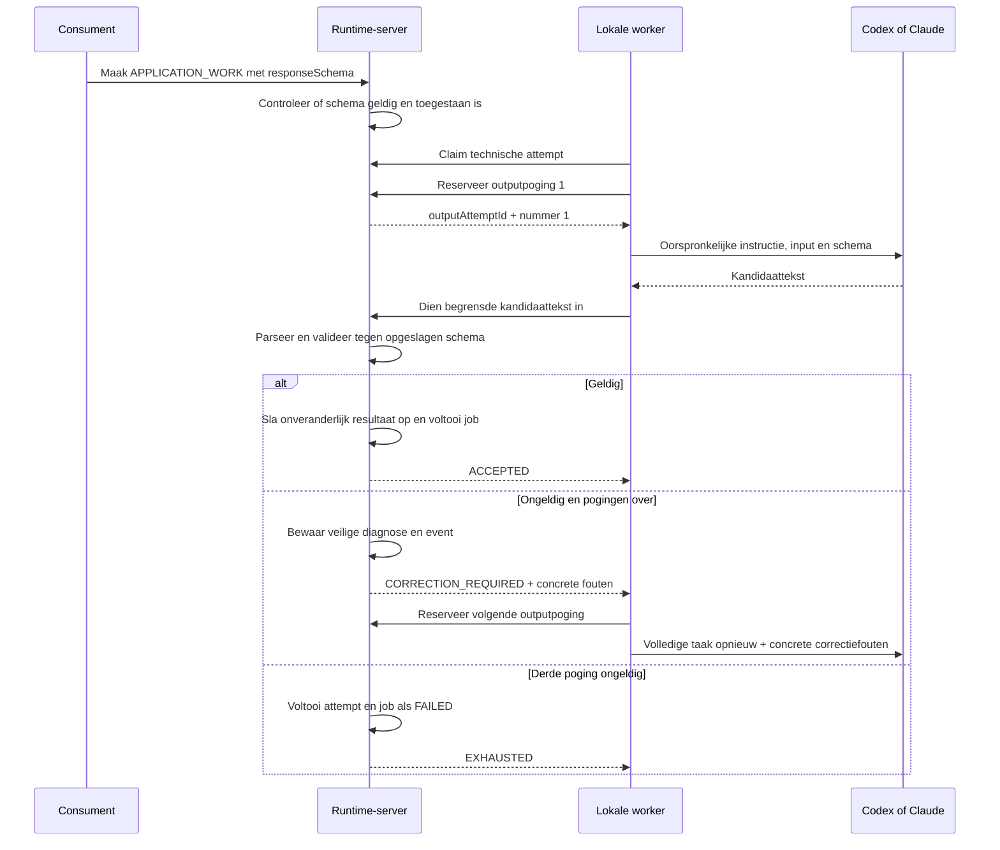

# Implementatieplan betrouwbare JSON-resultaten

## Doel en status

Dit document is een zelfstandig uitvoerbaar implementatieplan voor Agent Runtime. Een agent die
alleen deze repository en dit document krijgt, moet de wijziging kunnen uitvoeren zonder verdere
chatcontext.

Het doel is dat een AI-job pas `SUCCEEDED` wordt wanneer het resultaat geldige JSON is en, wanneer
de consument een `responseSchema` heeft meegegeven, volledig aan dat schema voldoet. Een model dat
proza, een codeblok, onvolledige JSON of een object met verkeerde velden teruggeeft, krijgt maximaal
drie gerichte kansen om het volledige antwoord opnieuw te maken. Daarna faalt de job met een
duidelijke, blijvende diagnose.

Spring AI wordt hiervoor bewust niet gebruikt. De bestaande Codex CLI- en Claude Code-adapters
blijven behouden, evenals de server-side `MOCKED`-route. Implementeer de validatie en
self-correction providerneutraal binnen Agent Runtime.

## Lees eerst

Lees vóór implementatie in deze volgorde:

1. [`../CLAUDE.md`](../CLAUDE.md)
2. [`../README.md`](../README.md)
3. [`agent-runtime-stappenplan.md`](agent-runtime-stappenplan.md)
4. [`architectuur-en-beveiliging.md`](architectuur-en-beveiliging.md)
5. de huidige contracten in
   `agent-runtime-contracts/src/main/kotlin/nl/vdzon/agentruntime/contracts/Contracts.kt`
6. de huidige serveruitvoering in
   `agent-runtime-server/src/main/kotlin/nl/vdzon/agentruntime/server/workers/ExecutionService.kt`
7. de huidige validatie in
   `agent-runtime-server/src/main/kotlin/nl/vdzon/agentruntime/server/jobs/JobService.kt`
8. de worker in
   `agent-runtime-worker/src/main/kotlin/nl/vdzon/agentruntime/worker/WorkerMain.kt`
9. het container-entrypoint in `execution-images/run-agent.sh`

Werk het huidige externe contract rechtstreeks bij. Er zijn nog geen actieve clients, dus bouw geen
parallelle versie of compatibiliteitslaag. Houd interne workeroperaties wel idempotent en
versieerbaar.

## Huidige situatie en probleem

De huidige eerste platformrelease bevat al een gedeeltelijke oplossing:

- `CreateJobRequest.responseSchema` kan een JSON Schema bevatten;
- het schema wordt als `/runtime/response-schema.json` in de execution-container geplaatst;
- Codex ontvangt het via `--output-schema`;
- Claude ontvangt het via `--json-schema`;
- de worker leest `/runtime/result.json` met Jackson;
- `JobService.validateResult(...)` valideert een geparseerde `JsonNode` op de server;
- de `MOCKED`-route gebruikt dezelfde servervalidatie.

Dit is nog niet betrouwbaar genoeg:

1. `SimpleJsonSchemaValidator` ondersteunt alleen enkele types, `required`, `properties`, `items`
   en `enum`. Geldige Draft 2020-12-regels zoals `additionalProperties`, grenzen, patronen en
   samengestelde geneste schema's worden niet volledig gecontroleerd.
2. Een syntactisch ongeldig modelantwoord faalt al in de worker als `RESULT_INVALID_JSON` en
   bereikt de centrale validator niet.
3. Een schema-afwijzing op `POST .../complete` wordt als een HTTP-fout teruggegeven. De huidige
   worker vangt dat uiteindelijk als `WORKER_ERROR` af. Daardoor verdwijnt de echte validatiefout.
4. Er is geen gerichte self-correction waarbij het model te horen krijgt welke velden ontbreken of
   welk datatype fout is.
5. De server-side technische attemptlimiet telt execution-attempts met leases en backoff. Deze mag
   niet worden misbruikt voor directe JSON-correcties.
6. De mock kan alleen een al geparseerde `JsonNode` voorbereiden. Daardoor kan hij geen ongeldige
   JSON, proza rond JSON of een reeks correctiepogingen simuleren.

## Kernbeslissingen

### Server is gezaghebbend

De server is de enige gezaghebbende beoordelaar van een AI-resultaat. De worker mag uitsluitend een
provider-specifieke transport-envelop uitpakken en de kandidaattekst begrenzen. Algemene
normalisatie, zoals het herkennen van één `json`-codeblok, gebeurt centraal op de server zodat echte
workers en `MOCKED` exact hetzelfde pad gebruiken. Alleen de server beslist of de kandidaat:

- syntactisch geldige JSON is;
- aan het opgeslagen `responseSchema` voldoet;
- als onveranderlijk jobresultaat mag worden vastgelegd.

Een consument ontvangt via `GET /v1/jobs/{jobId}/result` dus uitsluitend JSON die deze controle
heeft doorlopen.

### Technische attempt en outputpoging zijn verschillende begrippen

Behoud de bestaande technische attempt voor workerclaim, lease, heartbeat, fencing, crashherstel en
infrastructuurretry. Voeg daarnaast een **outputpoging** toe voor iedere modelaanroep die probeert
het gevraagde JSON-resultaat te produceren.

| Begrip | Betekenis | Retrygedrag |
|---|---|---|
| Technische attempt | Eén geclaimde uitvoering door een worker, beschermd met lease en fencing | Bestaande begrensde exponentiële backoff |
| Outputpoging | Eén modelaanroep voor het JSON-antwoord | Directe correctie zonder backoff |

Een job krijgt maximaal drie outputpogingen in totaal. Dit maximum is een server-side
platforminstelling en staat los van de eveneens server-side technische attemptlimiet. Begin met de
vaste standaardwaarde `3`. Maak de naam expliciet, bijvoorbeeld
`maxOutputAttempts`, zodat niemand beide tellers verwart.

De server reserveert en bewaart een outputpoging vóór de modelaanroep. Als de worker daarna crasht,
is die poging verbruikt; een volgende technische attempt kan alleen de resterende outputpogingen
gebruiken. Zo kan een crash niet tot onbeperkte modelaanroepen leiden. Wanneer het budget uitsluitend
door afgebroken technische uitvoeringen is uitgeput, gebruik dan een aparte technische fout zoals
`OUTPUT_ATTEMPTS_INTERRUPTED`; noem dat niet ten onrechte een JSON-afwijzing. De server-side
attemptgrens blijft daarnaast technische herstarts begrenzen.

### JSON-correctie geldt voor AI-uitvoer van `APPLICATION_WORK`

De self-correction-loop is bedoeld voor providergegenereerde resultaten van `APPLICATION_WORK`.
Het eindresultaat van `REPOSITORY_WORK` wordt deterministisch door de worker samengesteld nadat Git-
en verificatiestappen zijn afgerond. Een ongeldig repositoryresultaat is een programmeer- of
contractfout en mag nooit een tweede agentrun na publicatie veroorzaken.

### Schema blijft dynamisch

Agent Runtime kent de DTO's van Product Factory of Software Factory niet. De consument blijft een
opaque `responseSchema` meesturen. Genereer dus geen runtime-domeinklassen uit die schema's.
Valideer de resulterende `JsonNode` tegen het bij de job opgeslagen schema.

Een schema blijft optioneel voor achterwaartse compatibiliteit. Zonder schema moet het antwoord nog
steeds syntactisch geldige JSON zijn. Product Factory hoort voor alle AI-jobs waarbij het resultaat
wordt verwerkt wel altijd een schema mee te sturen.

## Beoogde keten



## Stap 1 — vervang de eenvoudige schemavalidator

Vervang `SimpleJsonSchemaValidator` door een volwaardige JSON Schema Draft 2020-12-validator.
Gebruik een onderhouden Java-library, bij voorkeur `com.networknt:json-schema-validator`, en pin de
versie centraal in de Maven dependency management. Voeg geen Spring AI-dependency toe.

Maak een eigen kleine adapter in de server, bijvoorbeeld `JsonResultValidator`, zodat de gekozen
library geen onderdeel wordt van contracten of andere modules. De adapter levert stabiele eigen
foutobjecten terug, bijvoorbeeld:

```kotlin
data class JsonValidationError(
    val path: String,
    val keyword: String,
    val message: String,
)
```

De foutvolgorde moet deterministisch zijn: sorteer op `path`, daarna `keyword`, daarna `message`.
Beperk het aantal teruggegeven fouten, bijvoorbeeld tot 25, en begrens iedere melding. Neem nooit
de volledige invoerwaarde op in een foutmelding.

Controleer een `responseSchema` al bij `POST /v1/jobs`:

- het schema moet zelf geldige JSON en een JSON-object zijn;
- het moet als Draft 2020-12 kunnen worden gecompileerd;
- externe of netwerk-$ref's zijn verboden;
- het schema moet een begrensde omvang hebben;
- niet-ondersteunde providerconstructies moeten vóór uitvoering een duidelijke aanvraagfout geven.

Gebruik hiervoor stabiele foutcodes:

- `RESPONSE_SCHEMA_INVALID`
- `RESPONSE_SCHEMA_UNSUPPORTED`
- `RESPONSE_SCHEMA_TOO_LARGE`

Maak voor de eerste versie een gedocumenteerd portable schema-profiel dat door Codex en Claude kan
worden gebruikt. Ondersteun minimaal:

- rootobjecten;
- `properties`, `required` en `additionalProperties`;
- geneste objecten;
- arrays met `items`, `minItems` en `maxItems`;
- `string`, `integer`, `number`, `boolean` en `null` waar de provider dit ondersteunt;
- `enum`;
- gangbare string- en getalgrenzen.

Sta ingewikkelde recursie, externe `$ref`, en providerafhankelijke combinaties niet stilzwijgend
toe. Wijs ze bij het aanmaken van de job af of documenteer en test expliciet dat beide engines ze
ondersteunen.

## Stap 2 — voeg duurzame outputpogingen toe

Voeg met een nieuwe Flyway-migratie een tabel toe, bijvoorbeeld `runtime_output_attempt`:

```text
id                       UUID/string primary key
job_id                   verwijzing naar runtime_job
execution_attempt_id     verwijzing naar runtime_attempt
output_attempt_number    oplopend binnen de job
status                   RESERVED, REJECTED, ACCEPTED, ABANDONED
candidate_sha256         nullable
diagnostic_excerpt       nullable, geredigeerd en begrensd
validation_errors_json   nullable, begrensd
provider                 momentopname
model                    momentopname
started_at
completed_at             nullable
```

Voeg een unieke constraint toe op `(job_id, output_attempt_number)`. Een netwerkretry van dezelfde
reservering of inzending mag nooit een extra poging verbruiken.

Sla geen onbeperkte of ongeredigeerde mislukte modeluitvoer op. Bewaar voor diagnose:

- SHA-256 van de volledige begrensde kandidaat;
- een door de bestaande redactor gehaalde uitsnede van maximaal 2.000 tekens;
- de gestructureerde validatiefouten;
- provider, model en tijden.

Het geldige eindresultaat blijft op de bestaande plek in `runtime_job.result_json` staan.

Voeg outputpoging-events toe, minimaal:

- `OUTPUT_ATTEMPT_STARTED`
- `OUTPUT_REJECTED_NOT_JSON`
- `OUTPUT_REJECTED_SCHEMA`
- `OUTPUT_CORRECTION_REQUESTED`
- `OUTPUT_ACCEPTED`
- `OUTPUT_ATTEMPTS_EXHAUSTED`

## Stap 3 — breid het interne workerprotocol uit

Voeg versieerbare interne workeroperaties toe voor:

1. het idempotent reserveren/starten van een outputpoging;
2. het indienen van de kandidaattekst;
3. het ontvangen van `ACCEPTED`, `CORRECTION_REQUIRED` of `EXHAUSTED`.

Een mogelijke contractvorm is:

```kotlin
data class StartOutputAttemptRequest(
    val attemptId: String,
    val fencingToken: String,
    val idempotencyKey: String,
)

data class OutputAttemptView(
    val outputAttemptId: String,
    val outputAttemptNumber: Int,
    val maxOutputAttempts: Int,
    val correctionErrors: List<JsonValidationError> = emptyList(),
)

data class SubmitOutputCandidateRequest(
    val attemptId: String,
    val fencingToken: String,
    val outputAttemptId: String,
    val candidateText: String,
    val usage: JsonNode? = null,
)

enum class OutputCandidateStatus {
    ACCEPTED,
    CORRECTION_REQUIRED,
    EXHAUSTED,
}

data class SubmitOutputCandidateResponse(
    val status: OutputCandidateStatus,
    val errorCode: String? = null,
    val validationErrors: List<JsonValidationError> = emptyList(),
    val outputAttemptsRemaining: Int,
)
```

Namen en URL's mogen tijdens implementatie worden verbeterd, maar behoud deze semantiek. Iedere
operatie gebruikt het bestaande attempt-ID en fencing token. Een oude of dubbele worker mag geen
outputpoging reserveren of indienen.

De kandidaat wordt als begrensde string verstuurd, niet als `JsonNode`. Anders kan syntactisch
ongeldige JSON de server nooit bereiken en kan de server de juiste fout niet classificeren.
Handhaaf de bestaande maximale resultaatgrootte van 5 MB vóór parsen.

Houd de bestaande `/complete`-route achterwaarts compatibel voor deterministische resultaten en
eventuele oudere workers. Nieuwe workers gebruiken voor `APPLICATION_WORK` de outputkandidaatroute.
Laat een schemafout op de oude `/complete`-route nooit meer als generieke `WORKER_ERROR` eindigen:
geef minimaal de echte stabiele foutcode terug en verander de actieve attempt niet voordat duidelijk
is of de caller nog kan corrigeren.

## Stap 4 — maak provideruitvoer voorspelbaar

Splits de huidige providerlogica uit `execution-images/run-agent.sh` en/of de worker op in duidelijk
testbare adapters voor Codex en Claude. Beide adapters leveren uiteindelijk één kandidaattekst aan
dezelfde workerloop.

### Codex

- blijf `--output-schema /runtime/response-schema.json` gebruiken wanneer een schema bestaat;
- blijf het laatste antwoord naar een bestand schrijven;
- controleer dat het bestand bestaat, regulier is en maximaal 5 MB groot is;
- behandel de inhoud als kandidaattekst, nog niet als geaccepteerd resultaat.

### Claude

- blijf `--json-schema` gebruiken wanneer een schema bestaat;
- houd rekening met model- en CLI-versies die alsnog proza of een codeblok teruggeven;
- als de gekozen outputvorm een Claude-envelope oplevert, gebruik eerst het echte
  `structured_output`-veld;
- gebruik anders de resultaatstekst als kandidaattekst.

### Providerextractie in de worker

De worker pakt alleen ondubbelzinnige providertransporten uit. Als de gekozen Claude-uitvoer een
envelope bevat, kiest de worker `structured_output` of het gedocumenteerde resultaatveld. De worker
zoekt niet zelf met accolades door vrije tekst en keurt niets zelf goed.

### Beperkte algemene normalisatie op de server

Na inzending geldt voor beide providers en voor `MOCKED` dezelfde begrensde normalisatie:

1. probeer de volledige getrimde tekst;
2. accepteer één volledig ` ```json ... ``` `-codeblok wanneer buiten het codeblok alleen witruimte
   of een korte bekende introductie staat;
3. ga niet willekeurig alle accolades in lange prozatekst af om een toevallig object te vinden.

Het doel is bekende presentatieomhulling verwijderen, niet een onbetrouwbaar modelantwoord alsnog
goedkeuren. Stop deze logica in één servercomponent die zowel de echte kandidaatroute als de mock
gebruikt.

## Stap 5 — bouw de directe self-correction-loop in de worker

Pas `JobExecutor` voor `APPLICATION_WORK` aan:

1. bereid workspace, prompt en schema eenmaal voor;
2. reserveer outputpoging 1 bij de server;
3. start de providercontainer;
4. blijf tijdens iedere modelaanroep heartbeats sturen;
5. dien de kandidaattekst in;
6. bij `ACCEPTED`: ruim op en stop;
7. bij `CORRECTION_REQUIRED`: maak een correctieprompt, reserveer de volgende outputpoging en start
   een nieuwe providercontainer;
8. bij `EXHAUSTED`: ruim op; de server heeft attempt en job al definitief afgehandeld.

Gebruik een unieke containernaam en resultaatbestandsnaam per outputpoging. Neem het
outputpogingnummer ook op in het versleutelde workerjournal, zodat crashherstel nooit per ongeluk
een oude kandidaat als nieuwe poging instuurt.

De correctieprompt bevat de volledige oorspronkelijke prompt en het oorspronkelijke schema opnieuw,
plus alleen concrete foutfeedback:

```text
Your previous answer was rejected.

Validation errors:
- $.stories is required.
- $.stories[0].title must be a string.

Return the complete answer again, not a patch.
Return only JSON that satisfies the original response schema.
Do not explain the correction.
```

Neem de volledige afgekeurde uitvoer niet opnieuw in de prompt op. Dat voorkomt contextgroei en het
onnodig herhalen van mogelijk gevoelige of foutieve inhoud. Beperk foutfeedback tot de door de server
geleverde gestructureerde fouten.

JSON-correcties krijgen geen `retryAfter` en geen exponentiële backoff. Ze gebeuren direct terwijl
dezelfde technische attempt en lease actief blijven. Providerstoringen, time-outs, workercrashes en
leaseverlies blijven de bestaande technische retryroute met backoff gebruiken.

## Stap 6 — maak foutcodes en eindstatus eenduidig

Gebruik minimaal deze foutcodes:

| Foutcode | Betekenis | Automatische JSON-correctie |
|---|---|---|
| `MODEL_OUTPUT_NOT_JSON` | Kandidaat kan niet als JSON worden geparseerd | Ja, als er outputpogingen over zijn |
| `MODEL_OUTPUT_SCHEMA_INVALID` | JSON voldoet niet aan het opgeslagen schema | Ja, als er outputpogingen over zijn |
| `MODEL_OUTPUT_RETRIES_EXHAUSTED` | Derde outputpoging is afgewezen | Nee, terminale jobfout |
| `OUTPUT_ATTEMPTS_INTERRUPTED` | Outputbudget raakte op door afgebroken technische uitvoeringen | Nee; terminale technische fout |
| `RESULT_TOO_LARGE` | Kandidaat overschrijdt 5 MB | Nee |
| `RESPONSE_SCHEMA_INVALID` | Consument leverde geen compileerbaar schema | Job wordt niet aangemaakt |
| `RESPONSE_SCHEMA_UNSUPPORTED` | Schema past niet binnen het ondersteunde portable profiel | Job wordt niet aangemaakt |
| `ENGINE_FAILED` | Providerproces stopte technisch fout | Bestaande technische retryroute |

Een derde ongeldige outputpoging sluit de technische attempt af als `FAILED` en de job als `FAILED`
met `MODEL_OUTPUT_RETRIES_EXHAUSTED`. De laatste validatiefouten blijven zichtbaar via jobdetails en
events. Een beheerder kan daarna de bestaande handmatige retryactie gebruiken. Een handmatige retry
is een expliciete nieuwe uitvoering en mag de outputpogingsteller resetten; documenteer dit in het
eventlog.

## Stap 7 — pas de centrale mock aan

Behoud de bestaande mogelijkheid om één geldige `result: JsonNode` voor te bereiden. Voeg
achterwaarts compatibel een manier toe om een reeks ruwe kandidaatteksten voor te bereiden,
bijvoorbeeld `outputSequence: List<String>`.

De mockexecutor doorloopt dezelfde centrale parse-, schema- en outputpoginglogica als een echte
worker, maar zonder worker, lease of container. Bouw geen tweede mockvalidator.

Ondersteun hiermee minimaal deze acceptatiescenario's:

- meteen geldige JSON;
- totaal ongeldige JSON;
- JSON in een toegestaan codeblok;
- proza zonder JSON;
- syntactisch geldige JSON met een ontbrekend verplicht veld;
- een verkeerd datatype;
- geldig resultaat na één correctie;
- geldig resultaat op de derde poging;
- drie afgewezen kandidaten en daarna `MODEL_OUTPUT_RETRIES_EXHAUSTED`;
- te grote kandidaat;
- bestaand voorbereid mockresultaat blijft werken.

Wanneer `outputSequence` meer kandidaten bevat dan het maximum, worden overtollige kandidaten niet
geconsumeerd. Wanneer de reeks eindigt voordat een geldige kandidaat verschijnt, faalt de mockjob
expliciet; hij blijft niet hangen.

## Stap 8 — tests

Voeg tests op vier niveaus toe.

### Validator-unittests

Test minimaal:

- required en `additionalProperties: false`;
- geneste objecten en arrays;
- enum en typefouten;
- `minItems`/`maxItems`;
- string- en getalgrenzen uit het gekozen portable profiel;
- deterministische foutvolgorde;
- maximaal aantal foutmeldingen;
- ongeldig schema;
- externe `$ref` wordt geweigerd.

### Server-integratietests

Test minimaal:

- een ruwe ongeldige kandidaat levert `CORRECTION_REQUIRED` en houdt dezelfde technische attempt
  actief;
- een tweede geldige kandidaat voltooit dezelfde job;
- de derde afwijzing geeft de terminale foutcode;
- outputpogingen zijn idempotent;
- een verkeerd fencing token kan niets reserveren of indienen;
- een oude technische attempt kan na leaseverlies niets indienen;
- een geldig resultaat is onveranderlijk;
- de oude `/complete`-route blijft werken;
- repositorywerk wordt niet opnieuw door AI uitgevoerd vanwege resultaatschemavalidatie.

### Worker-unittests

Maak container- en runtimeclientinteracties injecteerbaar waar dat nodig is. Test minimaal:

- Codex- en Claude-normalisatie;
- toegestaan JSON-codeblok;
- proza wordt niet willekeurig naar een toevallig object teruggebracht;
- correctieprompt bevat de validatiefouten en niet de volledige oude uitvoer;
- nieuwe container- en resultaatnaam per outputpoging;
- geen backoff tussen outputpogingen;
- heartbeats lopen door;
- crashherstel gebruikt het opgeslagen outputpoging-ID en dient niets dubbel in.

### End-to-end/mocktests

Doorloop met `MOCKED` de complete scenario's uit stap 7 en controleer status, resultaat,
outputpogingteller en eventvolgorde.

Voer uiteindelijk minimaal uit:

```bash
mvn -B --no-transfer-progress verify
```

Bouw ook het execution-image en voer, wanneer lokale Codex- en Claude-credentials beschikbaar zijn,
één handmatige smokejob per provider uit met een expres strikt schema. Een ontbrekend lokaal
provideraccount mag de geautomatiseerde build niet laten falen.

## Stap 9 — monitor en operationele informatie

Breid de bestaande monitor uit zodat bij een job zichtbaar is:

- technische attempts versus outputpogingen;
- hoeveel outputpogingen zijn gebruikt en hoeveel maximaal zijn toegestaan;
- laatste JSON-foutcode;
- veilige, begrensde validatiefouten;
- events van afwijzing, correctie en acceptatie;
- provider en model per outputpoging.

Toon nooit de volledige ongeldige uitvoer in de overzichtstabel. Een eventuele detailweergave toont
alleen de geredigeerde diagnose-uitsnede en is uitsluitend voor beheerders.

Voeg metrics toe voor minimaal:

- geaccepteerde output op poging 1, 2 en 3;
- aantal `MODEL_OUTPUT_NOT_JSON`;
- aantal `MODEL_OUTPUT_SCHEMA_INVALID`;
- aantal uitgeputte outputpogingen per provider en model;
- gemiddelde outputpogingen per geslaagde job.

Deze metrics maken zichtbaar welke goedkopere modellen structureel moeite hebben met schema's.

## Stap 10 — documentatie en contractconsistentie

Werk na implementatie minimaal bij:

- `README.md`;
- `docs/agent-runtime-stappenplan.md`;
- `docs/architectuur-en-beveiliging.md`;
- `docs/deployment-en-operatie.md`;
- `docs/runbook.md`;
- Kotlin-contracttypen;
- OpenAPI wanneer de betrokken worker- of testcontrolroutes daarin staan of worden opgenomen.

Leg expliciet vast:

- Spring AI wordt niet gebruikt;
- provider-native schemaopties zijn de eerste verdedigingslaag, geen bewijs van geldigheid;
- servervalidatie is gezaghebbend;
- outputcorrecties zijn direct en verschillen van technische retries;
- een consumer ontvangt alleen een terminale, schema-geldige uitkomst.

## Acceptatiecriteria

De wijziging is pas klaar wanneer al het volgende aantoonbaar waar is:

- een job met ongeldig of niet-ondersteund schema wordt vóór uitvoering afgewezen;
- geen syntactisch ongeldig modelantwoord kan als `SUCCEEDED` worden opgeslagen;
- geen schema-ongeldig antwoord kan als `SUCCEEDED` worden opgeslagen;
- Codex, Claude en MOCKED gebruiken uiteindelijk dezelfde servervalidator;
- een model krijgt maximaal drie gerichte outputpogingen;
- validatiefouten worden bij een correctiepoging teruggegeven aan het model;
- outputpogingen gebruiken geen infrastructuurbackoff;
- technische retries en crashherstel blijven werken zoals voorheen;
- fencing beschermt ook alle nieuwe outputoperaties;
- een netwerkretry kan geen outputpoging dubbel tellen;
- consumers hoeven geen JSON uit proza te extraheren;
- een geldig eindresultaat blijft onveranderlijk;
- foutcodes, pogingen en veilige diagnoses zijn in events en monitor zichtbaar;
- centrale mocks kunnen alle geldige en ongeldige JSON-scenario's deterministisch nabootsen;
- alle tests en Modulith-/architectuurcontroles slagen.

## Buiten scope

- Spring AI introduceren;
- prompts of domein-DTO's van Product Factory naar Agent Runtime verplaatsen;
- automatisch van provider of model wisselen na ongeldige JSON;
- onbeperkt JSON-objecten uit vrije prozatekst zoeken;
- een tweede retrymechanisme in Product Factory bouwen;
- repositorywerk opnieuw uitvoeren nadat de worker al heeft gepubliceerd, alleen omdat het
  deterministische resultaatobject niet klopt;
- volledige ongeredigeerde mislukte modeluitvoer langdurig bewaren.

## Verwachte oplevering

Lever één samenhangende wijziging aan het huidige contract op met:

- database-migratie;
- contractuitbreidingen;
- volledige servervalidator;
- duurzame outputpogingen;
- worker self-correction;
- Codex- en Claude-normalisatie;
- uitgebreide centrale mock;
- monitorinformatie en metrics;
- unit-, integratie- en scenario-tests;
- bijgewerkte documentatie.

Maak geen afzonderlijke consumerimplementatie voor deze betrouwbaarheid. Agent Runtime garandeert
zelf dat een succesvol technisch resultaat geldige, schema-conforme JSON is.
