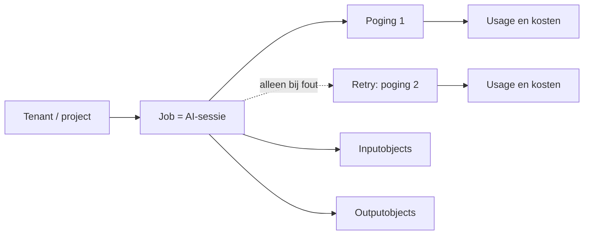
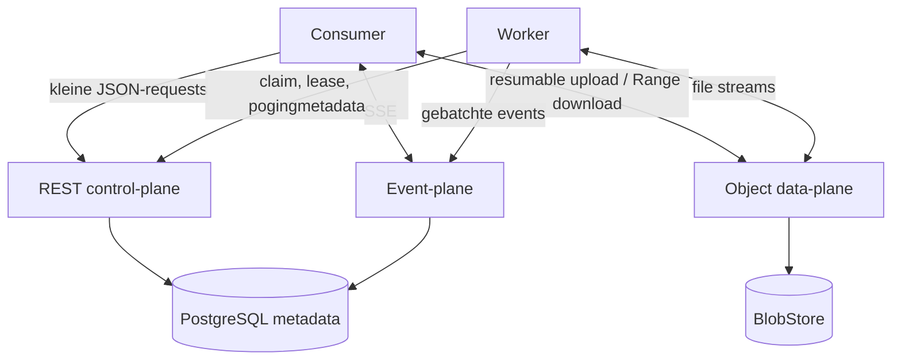

# Specificatie: uitbreidbare Agent Runtime

Status: geïmplementeerde v2-baseline
Scope: uitsluitend de Agent Runtime; migratie van consumerapplicaties valt buiten dit document.

## 1. Doel

De Agent Runtime wordt het centrale toegangspunt voor alle AI-uitvoering. De Runtime moet:

- verschillende leveranciers, uitvoeringswijzen en modellen ondersteunen;
- verschillende technische opdrachttypen betrouwbaar routeren;
- iedere job als één herkenbare AI-sessie registreren;
- usage en kosten kunnen rapporteren per project, leverancier, model, uitvoeringswijze en opdrachttype;
- live zichtbare voortgang, toolacties en beschikbare reasoning-samenvattingen tonen;
- grote input en output verwerken zonder Base64-JSON, JVM-buffering of database-BLOBs;
- bestaande asynchrone jobs, leases, retries, fencing en tenantisolatie behouden;
- bestaande `/v1`-consumenten tijdens een gefaseerde migratie blijven ondersteunen.

De aanbevolen oplossing houdt REST voor besturing, gebruikt streamende objectoverdracht voor grote
data en Server-Sent Events (SSE) voor live voortgang. Een overstap naar WebSockets of gRPC is niet
nodig.

## 2. Hoofdbeslissingen

1. Introduceer `/v2` voor het nieuwe jobcontract en behoud `/v1` tijdelijk als compatibiliteitslaag.
2. Houd jobmetadata klein. Prompts, inputbestanden en grote resultaten worden immutable objects
   waarnaar een job verwijst.
3. Sla objectbytes niet op in PostgreSQL op. PostgreSQL bewaart alleen metadata, relaties, status,
   usage en kosten.
4. Gebruik een `BlobStore`-abstractie. Productie gebruikt in de huidige single-node OpenShift-
   omgeving een filesystemimplementatie op de bestaande externe HDD; S3 blijft een eventuele
   latere implementatie, geen voorwaarde voor v2.
5. Maak leveranciers en modellen uitbreidbaar via string-ID's en Runtimeconfiguratie, niet via een
   in het publieke contract vastgebakken enum.
6. Eén job is voor consumers één AI-sessie. Een job heeft één poging en alleen bij een fout of
   ongeldige structured output een volgende poging.
7. Bewaar usage per poging in een typed, append-only ledger. Een vrij `usage`-JSON-object is niet
   de bron voor rapportages.
8. Bereken kosten server-side met een geversioneerde prijscatalogus. Workers rapporteren usage,
   maar bepalen geen prijzen.
9. Behandel subscriptiongebruik en API-kosten verschillend. Een abonnement heeft geen echte prijs
   per sessie; een eventuele verdeling van het maandbedrag wordt expliciet als allocatie getoond.
10. SSE is alleen voor gebeurtenissen, zichtbare voortgang en providergeleverde
    reasoning-samenvattingen. Canonieke resultaten en grote output worden altijd duurzaam als JSON
    of object opgeslagen.
11. Iedere v2-uitvoering levert intern `/job/output/result.json` en optionele gedeclareerde
    artifacts. Providerstdout is uitsluitend monitoring/logging en nooit het zakelijke resultaat.

## 3. Huidige situatie en knelpunten

De huidige `/v1`-implementatie heeft al een goede control-plane: jobs zijn asynchroon, idempotent en
tenantgebonden; workerattempts hebben leases, deadlines en fencing; resultaten en artifacts zijn na
succes immutable.

De beperkingen zitten vooral in de gegevensoverdracht en usageadministratie:

- een prompt staat inline in `CreateJobRequest` en is maximaal 200.000 tekens;
- inputattachments staan Base64-gecodeerd in hetzelfde JSON-document;
- de server decodeert het gehele bestand naar een `ByteArray`;
- een workerclaim bevat opnieuw de volledige jobrequest inclusief alle Base64-data;
- de worker decodeert de gehele attachment opnieuw en schrijft hem daarna naar disk;
- outputartifacts worden met `readBytes()` volledig in het workergeheugen geladen;
- inputattachments en outputartifacts staan als `BYTEA` in PostgreSQL;
- een outputcandidate is één JSON-string van maximaal 5 MiB;
- bestandslimieten zijn op meerdere plekken vastgelegd en lopen al uiteen: het contract en de
  documentatie noemen andere artifactaantallen/-totalen dan worker- en serverconfiguratie;
- usage is een ongetypeerd, optioneel JSON-object dat alleen bij een geaccepteerde output wordt
  opgeslagen;
- usage van mislukte calls, retries en correctiepogingen is daardoor niet betrouwbaar zichtbaar;
- de managementsamenvatting leest maximaal 5.000 jobs in geheugen en groepeert alleen op status.

Base64 voegt bovendien ongeveer een derde transportomvang toe. De fundamentele oplossing is niet
het verhogen van de bestaande limieten, maar het losmaken van metadata en bytes.

## 4. Begrippenmodel



### 4.1 Tenant/project

De bestaande `tenantId` blijft de projectdimensie voor kostenrapportage. Zolang ieder project een
eigen Runtimecredential heeft, is geen extra `projectKey` nodig. `pvdd` en `personal-news-feed`
zijn afzonderlijke projecten en krijgen dus afzonderlijke tenant-ID's en credentials. De eerste
bekende projecten zijn `product-factory`, `software-factory`, `hkh-autopilot`, `hkh`, `pvdd` en
`personal-news-feed`.

Deze lijst wordt niet vastgebakken in het rapportagecontract. Iedere toekomstige consumer krijgt
een eigen tenant-ID en verschijnt automatisch in overzichten zodra voor die tenant jobs, usage of
kosten zijn geregistreerd.

### 4.2 Job / AI-sessie

Een job is de logische, idempotente AI-sessie van een consumer. Voor normale overzichten is dit het
niveau waarop aantallen, usage en totale kosten worden getoond.

### 4.3 Poging en retry

Een poging is één uitvoering bij de gekozen leverancier. Normaal heeft een job uitsluitend poging
1. Alleen de volgende situaties kunnen een volgende poging starten:

- de provider of verbinding geeft een retrybare fout;
- de worker valt uit of verliest zijn lease;
- de provideroutput is geen geldig JSON of voldoet niet aan het gevraagde JSON-schema;

De reden van iedere retry wordt vastgelegd. Alle usage en kosten van alle pogingen worden bij
dezelfde job/AI-sessie opgeteld. Het dashboard toont standaard één regel per job en biedt de
pogingen alleen als technische drill-down.

Bij ongeldige structured output bewaart de server de validatiefouten en geeft hij die als
correctie-instructie mee aan de volgende poging. Er bestaat dus geen apart publiek
“correctie”-object of tweede retrymechanisme.

Leases en fencing blijven noodzakelijk om dubbele workeruitvoering te voorkomen, maar zijn interne
betrouwbaarheidsmechanismen. Ze zijn geen extra begrip in het consumercontract of kostenoverzicht.

## 5. Taxonomie voor opdrachten en leveranciers

### 5.1 Job kind

`jobKind` beschrijft de uitvoerings- en beveiligingsvorm, niet de AI-modaliteit:

| Job kind | Betekenis |
| --- | --- |
| `APPLICATION_WORK` | Zelfstandige AI-opdracht zonder publiceerbare Git-worktree |
| `REPOSITORY_WORK` | Agentopdracht met gecontroleerde Git-worktree en publicatie |

Er komen niet voor iedere nieuwe leverancier of dienst aparte job kinds bij.

### 5.2 Task type

`taskType` is de technische opdrachtsoort en wordt gebruikt voor validatie, routing, quota en
rapportage. De eerste catalogus bevat:

| Task type | Invoer | Uitvoer |
| --- | --- | --- |
| `STRUCTURED_GENERATION` | tekst/bestanden + JSON-schema | gevalideerd JSON-resultaat |
| `REPOSITORY_AGENT` | prompt + repositoryconfiguratie | commit/publicatieresultaat + artifacts |
| `TRANSCRIPTION` | audio/video-object | transcriptobject + metadata |
| `SPEECH_SYNTHESIS` | tekstobject of inline tekst | audio-object + metadata |
| `WEB_SEARCH` | zoekopdracht | klein JSON-resultaat en eventueel bronartifact |
| `EMBEDDING` | tekstobjecten | vectorartifact + metadata |
| `IMAGE_GENERATION` | tekst en optionele afbeeldingen | afbeeldingsobjecten + metadata |

De eerste implementatie hoeft niet al deze typen uit te voeren. De taxonomie voorkomt dat later
opnieuw een contractbreuk nodig is. Een onbekend of niet toegestaan task type geeft een duidelijke
`TASK_TYPE_UNSUPPORTED`- of `TASK_TYPE_FORBIDDEN`-fout.

Alle jobs leveren een JSON-object als resultaat. Gewone tekst heeft daarom geen apart task type
nodig, maar gebruikt binnen `STRUCTURED_GENERATION` een objectschema met één verplicht stringveld,
bijvoorbeeld `text`. Grote tekst wordt geen groot JSON-veld, maar een outputartifact.

### 5.3 Leverancier en uitvoeringswijze

Voor selectie en rapportage zijn vier velden voldoende:

| Dimensie | Voorbeeld | Betekenis |
| --- | --- | --- |
| `vendorId` | `openai`, `anthropic`, `elevenlabs`, `tavily` | Juridische leverancier/facturerende partij |
| `model` | concreet model-ID | Werkelijk gebruikt model |
| `mode` | `SUBSCRIPTION`, `API` of `MOCK` | Manier waarop de opdracht wordt uitgevoerd en afgerekend |
| `taskType` | `TRANSCRIPTION` | Bepaalt welke technische adapter/dienst nodig is |

Alle vier de velden zijn verplicht. Een mock gebruikt `vendorId=mock`, `model=mock` en
`mode=MOCK`. De combinatie van `vendorId`, `model`, `mode` en
`taskType` bepaalt intern de adapter. Een publiek `providerId` of `serviceId` voegt daarom geen
noodzakelijke informatie toe.

Mockjobs krijgen usage en kosten nul met bron `MOCK`, maar tellen standaard niet mee in financiële
of subscriptionpercentages.

Vendor- en model-ID's zijn begrensde strings. Ze zijn geen publieke enum,
zodat een nieuwe leverancier of een nieuw model geen nieuwe API-versie vereist.

De toegestane combinaties, limieten, tenantrechten en interne adapter staan in Runtimeconfiguratie.
Hiervoor is geen publieke catalogus-API nodig. Leveranciercredentials blijven in OpenShift Secrets
of op de subscriptionworker staan en komen niet in jobs, databasevelden of logs.

## 6. V2 API

### 6.1 Waarom een v2

Losse endpoints voor uploads zouden technisch aan `/v1` kunnen worden toegevoegd. Het nieuwe
contract verandert echter ook providersemantiek, task types, jobinput, resultaten en usage. Een
expliciete `/v2` voorkomt een half oud/half nieuw contract en beschermt bestaande clients met
exhaustieve enums.

`/v1` blijft gedurende de migratie ongewijzigd naast `/v2` beschikbaar. Bestaande consumers en
workers blijven daardoor hun huidige opslag- en uitvoeringspad gebruiken totdat ze doelbewust naar
v2 zijn omgezet. Nieuwe consumers gebruiken direct v2. Nadat alle consumers zijn gemigreerd kan een
aparte uitfaseringsbeslissing voor v1 worden genomen; die uitfasering hoort niet bij deze release.

### 6.2 Consumerendpoints

De tabel hieronder is alleen het overzicht. De volledige request- en responseschema's staan in de
aparte OpenAPI-specificatie
[`agent-runtime-v2.yaml`](../agent-runtime-contracts/src/main/resources/openapi/agent-runtime-v2.yaml).

| Methode en pad | Functie |
| --- | --- |
| `POST /v2/uploads` | Maak een tenantgebonden resumable upload aan |
| `HEAD /v2/uploads/{uploadId}` | Vraag actuele offset en status op |
| `PATCH /v2/uploads/{uploadId}` | Upload een binair chunk vanaf een gecontroleerde offset |
| `POST /v2/uploads/{uploadId}/complete` | Verifieer omvang/hash en maak het object immutable |
| `DELETE /v2/uploads/{uploadId}` | Verwijder een nog niet gekoppelde upload |
| `POST /v2/jobs` | Maak idempotent een job met objectreferenties |
| `GET /v2/jobs` | Zoek/pagineer eigen jobs |
| `GET /v2/jobs/{jobId}` | Lees status en samenvatting |
| `GET /v2/jobs/{jobId}/result` | Lees klein resultaat en outputobjectmetadata |
| `GET /v2/jobs/{jobId}/events` | Lees duurzame events met cursor |
| `GET /v2/jobs/{jobId}/event-stream` | Volg events via SSE |
| `GET /v2/jobs/{jobId}/objects/{objectId}/content` | Download bytes, met HTTP Range |
| `POST /v2/jobs/{jobId}/cancel` | Annuleer of vraag cancellation aan |
| `DELETE /v2/jobs/{jobId}/content` | Ruim content van een terminale job voortijdig op |
| `GET /v2/usage/summary` | Toon gebruik en kosten van de eigen tenant |
| `GET /v2/jobs/{jobId}/attempts` | Toon de technische pogingen en retryredenen van een job |

### 6.3 Uploadprotocol

Een upload is alleen nodig wanneer de job invoerbestanden gebruikt of wanneer tekst niet meer
veilig in het kleine job-JSON past. Voorbeelden zijn audio voor transcriptie, afbeeldingen, PDF's,
grote brondocumenten, JSON, `text/plain`, `text/markdown` en een zeer grote prompt. Tekstbestanden
zijn dus gewone uploadobjects; de uploadroute is niet alleen voor binaire media. Een normale prompt
onder de inline limiet heeft geen voorafgaande upload nodig.

De volgorde voor een job met grote invoer is:

1. reserveer de upload;
2. verstuur het bestand in hervatbare binaire chunks;
3. finaliseer de upload en ontvang een immutable `objectId`;
4. maak daarna de job en verwijs in `input.objects` naar dat `objectId`.

Het uploadprotocol volgt de kernsemantiek van resumable uploads:

1. De client reserveert een upload met bestandsnaam, MIME-type, verwachte omvang en SHA-256.
2. De server retourneert `uploadId`, gewenste chunkgrootte, expiry en actuele offset.
3. De client verstuurt raw `application/octet-stream`-chunks met `Upload-Offset`.
4. Een `HEAD` maakt hervatten na een verbroken verbinding mogelijk.
5. `complete` controleert totale omvang en SHA-256 en verandert status van `UPLOADING` naar `READY`.
6. Alleen een `READY` object kan aan een job worden gekoppeld.

Voorbeeld van het reserveren van een upload:

```json
{
  "filename": "interview.mp3",
  "mimeType": "audio/mpeg",
  "sizeBytes": 48399231,
  "sha256": "<64 hextekens>"
}
```

Voorbeeldresponse:

```json
{
  "uploadId": "uuid",
  "objectId": "uuid",
  "state": "UPLOADING",
  "protocol": "RESUMABLE_PATCH",
  "chunkSizeBytes": 8388608,
  "uploadUrl": "/v2/uploads/uuid",
  "expiresAt": "2026-09-07T12:00:00Z"
}
```

Uploads zijn niet globaal herbruikbaar. Ownership wordt afgeleid uit de beareridentity. Een client
kan niet testen of dezelfde hash bij een andere tenant bestaat.

### 6.4 Jobaanvraag

Een v2-job bevat alleen kleine metadata en objectreferenties:

```json
{
  "idempotencyKey": "daily-feed-2026-09-06",
  "jobKind": "APPLICATION_WORK",
  "taskType": "TRANSCRIPTION",
  "execution": {
    "vendorId": "openai",
    "model": "<toegestaan transcriptiemodel>",
    "mode": "API"
  },
  "input": {
    "instruction": "Transcribeer in het Nederlands en voeg timestamps toe.",
    "objects": [
      {
        "objectId": "uuid",
        "role": "SOURCE",
        "name": "audio"
      }
    ]
  },
  "output": {
    "resultSchema": {
      "type": "object",
      "required": ["language", "durationSeconds"],
      "properties": {
        "language": {"type": "string"},
        "durationSeconds": {"type": "number"}
      },
      "additionalProperties": false
    },
    "artifacts": [
      {
        "name": "transcript",
        "required": true,
        "mimeTypes": ["text/plain", "application/json"]
      }
    ]
  },
  "executionTimeoutSeconds": 3600
}
```

Regels:

- `execution.vendorId`, `execution.model` en `execution.mode` zijn altijd verplicht;
- de Runtime gebruikt exact de gevraagde vendor, het gevraagde model en de gevraagde mode;
- er is geen automatische leveranciers- of modelfallback;
- beschikbare reasoning-samenvattingen worden standaard als monitor-events gepubliceerd; hiervoor
  is geen extra joboptie nodig;
- een korte instructie mag inline blijven;
- een grote prompt gebruikt een object met MIME-type `text/plain` of `text/markdown`;
- `output.resultSchema` is verplicht voor `STRUCTURED_GENERATION`; gespecialiseerde task types
  mogen een vast Runtime-schema gebruiken;
- verwachte grote output wordt vooraf als named artifact-slot in `output.artifacts` gedeclareerd;
- objectreferenties moeten van dezelfde tenant zijn, `READY` zijn en bij jobcreatie atomair worden
  gekoppeld;
- idempotency vergelijkt de canonieke request plus object-ID's en hashes.

### 6.5 Jobresultaat

#### Canonieke file-based uitvoer

Iedere worker gebruikt voor iedere job dezelfde interne uitvoerafspraak:

```text
/job/output/
├── result.json             verplicht, klein en structured
└── artifacts/
    ├── transcript.txt      optioneel, vooraf gedeclareerd
    └── report.md           optioneel, vooraf gedeclareerd
```

Voor Codex en Claude schrijft de agent deze bestanden. Bij een rechtstreekse API-integratie schrijft
de provideradapter de API-response naar dezelfde structuur. Daardoor heeft de rest van de Runtime
één uniforme finalisatieketen.

De natuurlijke eindtekst, stdout en stderr van de AI/CLI zijn nooit het zakelijke jobresultaat. Ze
mogen alleen worden gebruikt voor begrensde en geredigeerde monitoring en diagnose. De Runtime
publiceert daarnaast een reasoning-samenvatting wanneer de gekozen provider die expliciet levert.
De Runtime belooft geen volledige interne chain-of-thought: die is niet uniform beschikbaar en mag
niet worden afgeleid uit verborgen providerdata. Na afloop:

1. leest en valideert de worker `result.json` tegen `output.resultSchema`;
2. controleert de worker dat alle verplichte artifact-slots aanwezig zijn;
3. uploadt de worker artifacts streamend;
4. stuurt de worker het kleine gevalideerde JSON-resultaat naar de server;
5. publiceert de server pas daarna het immutable jobresultaat.

Ontbreekt `result.json`, is het ongeldig of ontbreekt een verplicht artifact, dan geldt dit als
`INVALID_OUTPUT` en kan dezelfde job volgens de retrypolicy een volgende poging krijgen.

`result.json` bevat uitsluitend het kleine domeinresultaat en geen artifact-ID's of download-URL's.
Die identifiers bestaan namelijk pas nadat de worker de bestanden succesvol heeft geüpload. Een
bestand onder `artifacts/` gebruikt de naam van zijn gedeclareerde artifact-slot, bijvoorbeeld
`transcript.txt` voor slot `transcript`.

Na de uploads bouwt de server het publieke resultaatmanifest met twee aparte velden:

- `result`: de gevalideerde inhoud van `result.json`;
- `artifacts`: door de Runtime toegevoegde metadata en beveiligde download-URL's.

Consumers lezen dit manifest via de API. Zij kijken nooit rechtstreeks in de lokale workerdirectory
of de gedeelde BlobStore; die opslag is een intern implementatiedetail van de Runtime.

Het resultendpoint retourneert een klein manifest:

```json
{
  "jobId": "uuid",
  "status": "SUCCEEDED",
  "result": {
    "language": "nl",
    "durationSeconds": 1842
  },
  "artifacts": [
    {
      "objectId": "uuid",
      "role": "PRIMARY_RESULT",
      "filename": "transcript.json",
      "mimeType": "application/json",
      "sizeBytes": 1839921,
      "sha256": "<64 hextekens>",
      "downloadUrl": "/v2/jobs/uuid/objects/uuid/content"
    }
  ],
  "usageSummary": {
    "attemptCount": 1,
    "costState": "ESTIMATED"
  }
}
```

Het inline `result` blijft standaard maximaal 1 MiB. Grotere tekst, JSON, audio, afbeeldingen,
archieven en logs zijn outputobjects.

Een caller geeft verwachte grote output niet als speciaal veld in het JSON-schema aan, maar als
apart named artifact-slot in `output.artifacts`. Het kleine JSON-resultaat en de artifacts blijven
daardoor twee duidelijke kanalen. Het artifact `name` verbindt request en response. Bijvoorbeeld:

```json
{
  "result": {
    "language": "nl",
    "durationSeconds": 1842
  },
  "artifacts": [
    {
      "name": "transcript",
      "objectId": "uuid",
      "mimeType": "text/plain",
      "sizeBytes": 1839921,
      "downloadUrl": "/v2/jobs/uuid/objects/uuid/content"
    }
  ]
}
```

Dit is bewust expliciet. De Runtime verplaatst niet achteraf willekeurige grote JSON-velden naar
bestanden, want daarmee zou de response ongemerkt niet meer aan het opgegeven schema voldoen. Een
niet-gedeclareerd te groot inline resultaat geeft `INLINE_RESULT_TOO_LARGE`. Streaming maakt het
transport robuust, maar kan niet voorbij de maximale outputomvang van het gekozen model gaan.

### 6.6 Downloads

Downloads ondersteunen minimaal:

- streamende responsebody zonder `ByteArrayResource`;
- `Content-Length`, `Content-Type` en veilige `Content-Disposition`;
- `ETag` gebaseerd op SHA-256;
- `Accept-Ranges: bytes` en `Range`/`If-Range`;
- tenantautorisatie of kortlevende, objectgebonden downloadtickets;
- geen redirect naar een onbeveiligde permanente storage-URL.

Een consumer kan hierdoor een gedeeltelijke download hervatten. De server of objectstore hoeft het
bestand niet geheel in geheugen te laden.

### 6.7 Eventstream

Deze events zijn uitsluitend bedoeld om live de toestand van een job te volgen. Zonder SSE kan een
consumer dezelfde informatie blijven pollen via `GET /v2/jobs/{jobId}` en
`GET /v2/jobs/{jobId}/events`.

`GET /v2/jobs/{jobId}/event-stream` gebruikt `text/event-stream` en ondersteunt `Last-Event-ID`.
De volgende eventtypen zijn minimaal beschikbaar:

- `JOB_STATUS_CHANGED`;
- `ATTEMPT_STARTED` en `ATTEMPT_FINISHED`;
- `RETRY_SCHEDULED` met retryreden;
- `PROGRESS_UPDATED`;
- `LOG_MESSAGE` voor zichtbare, geredigeerde agenttekst, toolcalls, tooloutput en beschikbare
  reasoning-samenvattingen;
- `OUTPUT_OBJECT_READY`;
- `JOB_FINISHED`.

Events krijgen een monotoon oplopend jobsequence-nummer. Na reconnect leest de server eerst gemiste
duurzame events en schakelt daarna over naar live events. Volledige modeloutput en grote
resultaatbytes worden niet over deze stream verstuurd. Zichtbare uitvoeringslogs mogen wel begrensd
worden meegestuurd, zodat de monitor live kan tonen wat de agent uitvoert.

Een provideradapter normaliseert live inzicht als `LOG_MESSAGE` met een van deze `logKind`-waarden:

- `AGENT_TEXT`: zichtbare tussenberichten of een korte preamble van de agent;
- `REASONING_SUMMARY`: uitsluitend een samenvatting die de provider als zichtbare summary levert;
- `TOOL_CALL` en `TOOL_OUTPUT`: welke actie wordt uitgevoerd en het geredigeerde resultaat;
- `SYSTEM`: Runtime- en workerdiagnostiek.

Providers verschillen hierin. Bij OpenAI kan een model/API-combinatie reasoning-summary-delta's
streamen; een adapter voegt kleine providerdelta's samen en publiceert ze met `logStreamId` en
`logFinal`. Een subscription-CLI levert soms alleen zichtbare agenttekst en toolacties. Wanneer een
provider geen summary levert, verzint de Runtime er geen en blijft `REASONING_SUMMARY` voor die job
afwezig. De monitor noemt dit daarom **reasoning-samenvatting**, niet **chain-of-thought**.

Logevents zijn maximaal 8 KiB per event, maximaal 10 MiB per job, worden op secrets geredigeerd en
hebben een kortere retentie dan jobresultaten. De eventpagina en SSE-stream gebruiken hetzelfde
`JobEventView`-schema; live kijken en later terugkijken geven dus dezelfde zichtbare informatie.

SSE verbetert live UX en voorkomt polling, maar is geen opslag- of bestandstransport. Een client
moet na `JOB_FINISHED` altijd het canonieke resultendpoint kunnen lezen.
SSE is niet nodig om de problemen met grote input/output op te lossen en kan als laatste, optionele
fase worden geïmplementeerd.

SSE is een gewone HTTP-GET waarvan de verbinding open blijft. De server stuurt telkens een klein
tekstblok wanneer er iets verandert:

```text
id: 17
event: PROGRESS_UPDATED
data: {"jobId":"...","phase":"EXECUTING","progressPercent":60}

id: 18
event: LOG_MESSAGE
data: {"jobId":"...","logKind":"REASONING_SUMMARY","logStreamId":"summary-1","logText":"Ik vergelijk nu de twee bronnen.","logFinal":false}

id: 19
event: JOB_FINISHED
data: {"jobId":"...","status":"SUCCEEDED"}
```

De client hoeft daardoor niet iedere paar seconden te vragen of de job al klaar is. Valt de
verbinding weg, dan maakt de client een nieuwe GET met `Last-Event-ID: 18`; de server vervolgt na
dat event. Het verkeer loopt alleen van server naar client. Voor commando's zoals annuleren blijft
de gewone REST-API in gebruik.

SSE is geen long polling. Bij long polling wacht de server op maximaal één verandering, beëindigt
daarna de response en opent de client steeds een nieuwe request. Bij SSE blijft één response open
en kan de server daar achter elkaar meerdere events over sturen. De bestaande workerclaim mag wel
long polling blijven gebruiken; dat staat los van de SSE-monitorstream.

### 6.8 Worker-API

De bestaande register/claim/heartbeat/fencing-opzet blijft bestaan. De worker-API verandert als
volgt:

- registratie adverteert vendors, execution modes, task types, modellen, MIME-types en limieten;
- een claim bevat uitsluitend metadata en inputobjectreferenties, nooit Base64-content;
- een worker downloadt invoer rechtstreeks streamend naar een bestand;
- een worker uploadt uitvoer vanuit een bestand/stream, nooit via `readBytes()`;
- objectmutaties vereisen attempt-ID en fencing token;
- de server start de poging atomair wanneer een worker de job claimt;
- usage-events zijn idempotent en mogen ook tijdens een poging worden ingestuurd;
- een mislukte poging eindigt als `ABANDONED` of `FAILED`, maar verwijdert vastgelegde usage niet.

Nieuwe workerendpoints:

| Methode en pad | Functie |
| --- | --- |
| `GET /v2/workers/{workerId}/jobs/{jobId}/objects/{objectId}/content` | Gefencete inputdownload |
| `POST /v2/workers/{workerId}/jobs/{jobId}/output-objects` | Reserveer outputobject |
| uploadendpoints uit het transferticket | Stream outputbytes |
| `POST /v2/workers/{workerId}/jobs/{jobId}/attempts/{attemptId}/logs` | Voeg begrensde, zichtbare uitvoeringslog toe |
| `POST /v2/workers/{workerId}/jobs/{jobId}/attempts/{attemptId}/usage-events` | Voeg usage toe |
| `POST /v2/workers/{workerId}/jobs/{jobId}/attempts/{attemptId}/finish` | Sluit poging af |

De claimresponse bevestigt de werkelijk gebruikte dimensies:

```json
{
  "attemptId": "uuid",
  "vendorId": "openai",
  "model": "<werkelijk model>",
  "mode": "SUBSCRIPTION",
  "reason": "INITIAL"
}
```

Een usage-event is typed:

```json
{
  "eventId": "provider-event-of-lokale-idempotency-key",
  "observedAt": "2026-09-06T12:34:56Z",
  "metrics": [
    {"metric": "INPUT_TOKENS", "quantity": "12740", "unit": "TOKEN"},
    {"metric": "CACHED_INPUT_TOKENS", "quantity": "8200", "unit": "TOKEN"},
    {"metric": "OUTPUT_TOKENS", "quantity": "1150", "unit": "TOKEN"}
  ],
  "providerRequestId": "optioneel-begrensd-id",
  "source": "PROVIDER_REPORTED"
}
```

Hoeveelheden en bedragen worden als decimal strings over de API verzonden om
floating-pointafronding te voorkomen.

## 7. Object- en streamingarchitectuur

### 7.1 Drie planes



### 7.2 BlobStore

De servercode gebruikt een interface voor create, append/part-upload, finalize, open-range,
metadata en delete.

De gekozen eerste productie-implementatie is `FilesystemBlobStore` op de bestaande externe HDD. Uit
de infrastructuurinventarisatie blijkt dat dit een 16 TB-schijf is (circa 15 TB live), als exFAT
gemount op `/var/mnt/external-hdd` van het single-node cluster. Het is technisch een `hostPath`, geen
door de huidige `local-path` StorageClass geleverde RWX-fileshare. Voor deze single-node opzet is dat
geen bezwaar.

Gebruik een exclusieve subdirectory, bijvoorbeeld
`/var/mnt/external-hdd/agent-runtime-objects`, en mount alleen die directory in de Agent Runtime-
server en de cleanupcomponent. Workers en consumers mounten de schijf niet; zij uploaden en
downloaden uitsluitend via de Runtime-API. Daardoor blijven tenantautorisatie, hashing, quota en
retentie centraal afgedwongen.

De filesystemimplementatie moet:

- ieder object onder een door de Runtime gegenereerde key opslaan, zonder gebruikersbestandsnamen
  als padcomponent;
- chunks eerst naar een uniek tijdelijk bestand schrijven en na omvang- en SHA-256-controle met een
  atomische rename op hetzelfde filesystem finaliseren;
- geen POSIX-xattrs of bestandsrechten als bron voor objectmetadata gebruiken, omdat de schijf exFAT
  is; metadata en ownership blijven in PostgreSQL;
- bestandhandles streamend openen voor upload, Range-download en delete;
- vrije ruimte bewaken en uploads ruim vóór een volle schijf weigeren;
- bij startup en periodiek tijdelijke/verweesde bestanden reconciliëren.

De `BlobStore`-interface blijft klein zodat later desgewenst een `S3BlobStore` kan worden toegevoegd.
Die migratie is niet nodig om v2 betrouwbaar te bouwen. De 16 TB is capaciteit, geen redundantie;
voor onvervangbare artifacts is nog steeds een backupbeleid nodig.

### 7.3 Limieten en quota

Limieten zijn policy per tenant, task type, vendor, model en execution mode, niet verspreide constanten in server en
worker. Aanbevolen startwaarden:

| Grens | Startwaarde |
| --- | ---: |
| Inline instructie | 64 KiB |
| Inline gestructureerd resultaat | 1 MiB |
| Object | 2 GiB |
| Totaal input per job | 5 GiB |
| Totaal output per job | 5 GiB |
| Uploadchunk | 8 MiB |
| Onvoltooide uploadretentie | 24 uur |
| Jobobjectretentie | configureerbaar, standaard 30 dagen |

Deze Runtimegrenzen betekenen niet dat ieder model dezelfde omvang aankan. Voor iedere
uitvoeringscombinatie gelden aanvullend leverancier- en modelgrenzen.

### 7.4 Vier verschillende groottegrenzen

De Runtime rapporteert duidelijk welke grens is geraakt:

1. `TRANSPORT_LIMIT_EXCEEDED`: upload-, download- of tenantquota;
2. `PROVIDER_INPUT_LIMIT_EXCEEDED`: providerbestands- of requestlimiet;
3. `MODEL_CONTEXT_LIMIT_EXCEEDED`: te veel tokens voor het modelcontextvenster;
4. `MODEL_OUTPUT_LIMIT_EXCEEDED`: gevraagde generatie overschrijdt de modelgrens.

Streaming lost alleen transport- en geheugenproblemen op. Het vergroot geen modelcontextvenster en
geen maximale modeloutput. Grote semantische input vereist chunking, transcriptievoorbewerking,
retrieval of een meerstapsjob. Grote binaire/tekstuele output wordt een object.

## 8. Usage- en kostenmodel

### 8.1 Usage metrics

Ondersteunde metrics zijn uitbreidbare codes uit een catalogus, waaronder:

- `INPUT_TOKENS`;
- `CACHED_INPUT_TOKENS`;
- `CACHE_WRITE_TOKENS`;
- `OUTPUT_TOKENS`;
- `REASONING_TOKENS`;
- `AUDIO_INPUT_SECONDS`;
- `AUDIO_OUTPUT_SECONDS`;
- `CHARACTERS`;
- `SEARCH_REQUESTS`;
- `EXTRACT_REQUESTS`;
- `IMAGES`.

De ruwe providerresponse mag begrensd voor diagnose worden opgeslagen, maar rapportages gebruiken
uitsluitend genormaliseerde metrics. De Runtime stelt hiervoor geen applicatieve versleuteling
verplicht.

### 8.2 Kosten

De Runtime ondersteunt drie kostensoorten:

| Kostensoort | Betekenis |
| --- | --- |
| `DIRECT` | Door leverancier gerapporteerde werkelijke kosten |
| `CALCULATED` | Runtimeberekening voor een werkelijk via de API uitgevoerde job |
| `API_EQUIVALENT` | Geschatte API-prijs van een job die werkelijk via een abonnement is uitgevoerd |
| `ALLOCATED` | Toegerekend deel van een vast abonnement of infrastructuurbedrag |

Iedere kostenregel bevat:

- attempt-ID en job-ID;
- vendor, model, execution mode en task type als snapshot;
- usage metric en quantity;
- unit size, unit price, currency en bedrag als decimal;
- prijsversie en geldigheidsperiode;
- kostensoort;
- status `ESTIMATED`, `FINAL` of `RECONCILED`;
- bron en berekentijdstip.

Tariefwijzigingen herschrijven historische kosten niet. Herberekening maakt een nieuwe
kostenversie en markeert de oude als vervangen.

### 8.3 Abonnementen

Bij Codex- en Claude-subscriptionroutes is doorgaans wel usage of quota-aandeel beschikbaar, maar
geen echte factuurprijs per job/AI-sessie. Daarom geldt:

- `directCost` blijft leeg;
- usage blijft volledig zichtbaar;
- de Runtime berekent uit gemeten tokens en de openbare API-lijstprijs altijd een
  `API_EQUIVALENT`-schatting wanneer voor het model een tarief bekend is;
- dashboards noemen dit nadrukkelijk **API-equivalent (abonnement)** en tonen de werkelijke
  uitvoeringswijze ernaast;
- dashboards tonen daarnaast het percentage van de gemeten subscriptionusage per project;
- optioneel wordt een maandelijks abonnement als `ALLOCATED` verdeeld;
- de UI noemt een allocatie nooit “werkelijke providerkosten”.

De API-equivalente schatting is geen factuurbedrag en zegt niets over resterende abonnementsquota.
Tarieven zijn geversioneerd en herleidbaar tot de openbare leveranciersbron. Voor een
subscriptionmodel zonder afzonderlijk openbaar API-tarief mag uitsluitend een expliciet
gedocumenteerd proxymodel worden gebruikt; anders blijft het bedrag onbekend. De initiële catalogus
gebruikt voor `gpt-5.3-codex-spark` de openbare prijs van `gpt-5.3-codex` als proxy.

De allocatiemethode is configureerbaar en geversioneerd, bijvoorbeeld naar rato van gewogen tokens
of gerapporteerde quota-eenheden. Wanneer een CLI onvoldoende usage rapporteert, krijgt de poging
`usageQuality=PARTIAL` of `UNAVAILABLE`; ontbrekende usage wordt nooit als nul geïnterpreteerd.

### 8.4 API-routes

API-leveranciers rapporteren waar mogelijk de officiële usagevelden en providerrequest-ID. De Runtime
berekent direct na de poging een geschatte kostprijs uit de actieve prijscatalogus. Een periodieke
reconciliatie kan leverancierstotalen vergelijken met billing- of usage-exporten en de status naar
`RECONCILED` brengen.

### 8.5 Aggregaties

Alle kosten van alle pogingen tellen mee, ook van:

- afgewezen outputcorrecties;
- technische retries;
- pogingen die na gedeeltelijk gebruik falen;
- jobs die uiteindelijk worden geannuleerd of mislukken.

De job toont daardoor zowel de kosten van het succesvolle eindresultaat als de totale werkelijke
inspanning die nodig was.

## 9. Datamodel

Nieuwe hoofdtabellen:

### `runtime_object`

- `id`, `tenant_id`, `state`, `purpose`;
- `filename`, `mime_type`, `size_bytes`, `sha256`;
- `blob_store`, `blob_key`;
- `created_at`, `ready_at`, `expires_at`, `deleted_at`;
- eventuele veilige validatiefoutcode.

### `runtime_job_object`

- `job_id`, `object_id`;
- `direction` (`INPUT` of `OUTPUT`);
- `role`, `logical_name`, `sequence_number`;
- unieke constraints zodat finalisatie idempotent is.

### Uitbreiding van `runtime_attempt`

- `task_type`, `vendor_id`, `model` en `execution_mode` als snapshot;
- `reason` (`INITIAL`, `INVALID_OUTPUT`, `PROVIDER_ERROR` of `TECHNICAL_ERROR`);
- `provider_request_id` of vergelijkbaar leveranciers-ID indien beschikbaar;
- `usage_quality`;
- bestaande status, lease, fencing en tijdstippen blijven behouden.

De huidige aparte `runtime_output_attempt` blijft alleen voor de v1-compatibiliteitslaag. In v2 is
een ongeldige structured output een normale volgende jobpoging, zodat er niet twee verschillende
soorten attempts in het functionele model bestaan.

### `runtime_usage_entry`

- `id`, `attempt_id`, `event_id`, `metric`, `quantity`, `unit`;
- `source`, `observed_at`, `received_at`;
- unieke `(attempt_id, event_id, metric)` voor idempotentie.

### `runtime_price_rate`

- `id`, `vendor_id`, optioneel model/execution mode/task type;
- `metric`, `unit_size`, `unit_price`, `currency`;
- `valid_from`, `valid_until`, `version`, `source_reference`.

### `runtime_cost_entry`

- `id`, `job_id`, `attempt_id`, `usage_entry_id`, `price_rate_id`;
- `cost_kind`, `cost_status`, `amount`, `currency`;
- `calculation_version`, `calculated_at`, `superseded_at`.

### `runtime_subscription_period`

- vendor/credentialprofiel en kalenderperiode;
- vast bedrag en currency;
- allocatiemethode en versie;
- finalisatiestatus.

Voor snelle dashboards komen indexen op tijd, tenant, task type, vendor, model, execution mode en
attemptstatus. Rapportages gebruiken SQL-aggregatie; ze laden niet eerst duizenden
jobs in applicatiegeheugen.

De huidige `runtime_input_attachment.content` en `runtime_artifact.content` worden na migratie
verwijderd. Het bestaande `usage_json` blijft tijdelijk leesbaar voor v1, maar is niet langer de
administratieve bron.

## 10. Rapportage-API en monitor

### 10.1 Endpoints

| Endpoint | Doel |
| --- | --- |
| `GET /v2/management/usage/summary` | Gegroepeerde aantallen, usage en kosten |
| `GET /v2/management/usage/timeseries` | Dag/week/maandreeksen |
| `GET /v2/management/jobs` | Gepagineerde AI-sessies/jobs en drill-down |
| `GET /v2/management/jobs/{id}/attempts` | Pogingen met retryreden, usage en kostenregels |
| `GET /v2/management/prices` | Geldende en historische tarieven |
| `POST /v2/management/prices` | Voeg nieuwe tariefversie toe |
| `GET /v2/management/subscriptions` | Abonnementsperioden en allocatiestatus |

Filters:

- `from` en `until` in UTC;
- tenant/project;
- task type;
- vendor;
- model;
- execution mode;
- job- en attemptstatus;
- cost kind en cost status.

Toegestane `groupBy`-dimensies zijn dezelfde gecontroleerde velden. Vrije SQL-achtige groupings zijn
niet toegestaan.

Een summaryrow bevat minimaal:

- aantal jobs/AI-sessies en pogingen;
- geslaagd, mislukt, geannuleerd en partial usage;
- genormaliseerde usage per unit;
- direct, calculated, API-equivalent en allocated cost afzonderlijk;
- totaal toegerekende kosten;
- currency;
- aantal jobs en pogingen met onbekende usage of kosten.

Bedragen met verschillende currencies worden niet stil bij elkaar opgeteld.

### 10.2 Monitorpagina's

1. **Gebruik en kosten**: periodefilters, totalen, verdeling en tijdreeks.
2. **AI-sessies**: één regel per job met project, task type, vendor, model, execution mode, status,
   totale usage en totale kosten.
3. **Jobdetail**: pogingen, retryredenen, providerrequest-ID, usagekwaliteit, prijsversie en alle
   kostenregels.
4. **Leveranciers en modellen**: beschikbaarheid, task types, execution modes en workerstatus.
5. **Tarieven en abonnementen**: alleen beheer; historie blijft zichtbaar.

Van ieder aggregaat moet naar jobs/AI-sessies en vervolgens naar de onderliggende pogingen kunnen
worden doorgeklikt.

## 11. Beveiliging, privacy en lifecycle

- Objectautorisatie gebruikt altijd tenant plus jobrelatie; kennis van een UUID is onvoldoende.
- Workerdownloads en -uploads vereisen het actuele attempt-ID en fencing token.
- Uploadtickets en eventuele presigned URLs zijn kortlevend en objectgebonden.
- Objecten zijn na finalisatie immutable en worden bij downloaden tegen hun hash gecontroleerd.
- MIME-validatie gebeurt task-type-specifiek en gebruikt zowel declaratie als contentsniffing.
- Prompts, objectbytes, transcriptinhoud en providerresponses komen niet in accesslogs of metrics.
- Interne service-to-serviceverbindingen binnen het OpenShift-cluster mogen gewone HTTP gebruiken;
  TLS is geen Runtime-eis voor dit interne verkeer.
- De filesystem-BlobStore op de externe HDD vereist geen applicatieve encryption at rest. Toegang
  wordt afgeschermd via OpenShift, de server-API en de exclusief gemounte opslagdirectory.
- Onvoltooide uploads verlopen automatisch. Retentie van input, output, transcript en
  administratieve usage zijn afzonderlijk configureerbaar.
- Usage- en kostenregels blijven bewaard wanneer content volgens retentiebeleid wordt verwijderd.
- Deletes zijn eerst logisch en worden daarna door een garbage-collector fysiek uitgevoerd.
- Hashdeduplicatie mag alleen intern binnen dezelfde tenant en mag geen cross-tenant side channel
  veroorzaken.

### 11.1 Retentie en automatische cleanup

Ieder upload- en outputobject krijgt een expliciete `retentionUntil`. De startwaarden zijn
configureerbaar per tenant, maar worden als volgt voorgesteld:

| Gegevens | Cleanupmoment |
| --- | --- |
| Afgebroken upload met status `UPLOADING` | 24 uur na de laatste ontvangen chunk |
| Voltooide upload die nooit aan een job is gekoppeld | 24 uur na status `READY` |
| Inputobjects van een actieve job | nooit zolang de job niet terminaal is |
| Input- en outputobjects van een geslaagde job | standaard 30 dagen na afronding |
| Partiële output van een mislukte/geannuleerde job | standaard 7 dagen na afronding |
| Lokale workerdirectory met tijdelijke input/output | direct na bevestigde finalisatie; orphan-cleanup bij workerstart |
| Zichtbare monitorlogs/events | standaard 14 dagen |
| Jobmetadata, usage en kosten | apart administratief retentiebeleid; niet gekoppeld aan filecleanup |

Een periodieke Runtime-cleanup-taak voert de opruiming uit. Dit kan een scheduled component in de
server of een afzonderlijke OpenShift CronJob zijn. Verwijderen is tweefasig en idempotent:

1. selecteer verlopen objects die niet meer door een actieve job worden gebruikt;
2. zet de metadata op `DELETE_PENDING`;
3. verwijder de bytes uit de BlobStore;
4. zet de metadata op `DELETED` en bewaar een kleine tombstone met object-ID, hash, omvang en
   verwijdertijd;
5. probeer een mislukte BlobStore-delete later opnieuw.

Een afzonderlijke reconciler zoekt periodiek naar verweesde BlobStore-objecten zonder
databaserecord en naar databaserecords waarvan de bytes ontbreken. Daardoor blijven crashes tussen
stap 2 en 4 herstelbaar.

Een consumer kan content van een terminale eigen job ook eerder laten opruimen met
`DELETE /v2/jobs/{jobId}/content`. Dit verwijdert inputobjects, outputartifacts en bewaarde
monitorlogs, maar behoudt jobstatus, retryhistorie, usage en kosten. Een actieve job kan niet worden
opgeruimd.

## 12. Betrouwbaarheid en observability

- Alle muterende endpoints zijn idempotent of gebruiken een idempotency key.
- Uploadchunks accepteren alleen de verwachte offset; een herhaalde chunk verandert geen object.
- Objectfinalisatie is atomair: een job ziet nooit een gedeeltelijk bestand.
- Attempt- en usage-events zijn append-only en gefencet.
- Een verlopen actieve poging wordt door een reconciler gemarkeerd als `ABANDONED`.
- Providerrequest-ID's maken vergelijking met leveranciers mogelijk zonder prompts te loggen.
- Metrics bevatten geen job-ID als Prometheus-label om cardinaliteit te begrenzen.
- Relevante metrics zijn onder meer bytes in/uit, uploadduur, actieve uploads, BlobStore-errors,
  pogingen per uitvoeringscombinatie, usagekwaliteit, onbekende kosten, queuewachttijd en
  leverancierlatency.
- Healthchecks maken onderscheid tussen control-plane, database, BlobStore en providerworker.

## 13. Implementatiestappen

### Fase 0 — Besluiten en contractfixtures

1. Leg de drie planes, begrippen en v2-keuze vast als ADR's.
2. Leg de externe-HDD-subdirectory, vrije-ruimte-grens, retentie en quota vast.
3. Leg vendor-, model-, execution-mode-, task-type- en usagecodes vast.
4. Maak OpenAPI-contractfixtures voor upload, job, result, SSE, poging en rapportage.
5. Voeg contracttests toe die v1-compatibiliteit bewaken.

Klaar wanneer de OpenAPI v2 reviewbaar is en geen implementatiebeslissing meer in consumercode
hoeft te worden genomen.

### Fase 1 — Typed pogingen en usage ledger

1. Breid attempts uit en voeg de usage-, price- en costtabellen toe met Flyway.
2. Implementeer attempt usage/finish met fencing en idempotentie.
3. Pas Codex- en Claude-adapters aan om machineleesbare usage vast te leggen waar beschikbaar.
4. Registreer iedere correctiepoging en retry als volgende poging binnen dezelfde job.
5. Leid voor oude v1-uitvoer tijdelijk een compatibility usage summary af.
6. Voeg tests toe voor success, failure, cancellation, retry en workercrash.

Klaar wanneer geen billable leveranciersaanroep kan plaatsvinden zonder duurzame attemptrow en
expliciete usagekwaliteit.

### Fase 2 — BlobStore en objectmetadata

1. Introduceer `BlobStore` en implementeer `FilesystemBlobStore` voor lokaal gebruik en productie.
2. Voeg object- en job-objecttabellen toe.
3. Implementeer streamende create/upload/head/complete/download/delete.
4. Voeg hash-, omvang-, MIME-, quota- en tenantvalidatie toe.
5. Implementeer Range-downloads en hervatbare uploads.
6. Voeg cleanup voor verlopen uploads en retentie toe.
7. Test afgebroken transfers, verkeerde offsets, verkeerde hashes en serverrestarts.

Klaar wanneer een object van de maximale toegestane omvang kan worden geüpload en gedownload met
constant JVM-geheugengebruik.

### Fase 3 — V2 jobs en workertransfer

1. Voeg `taskType`, executionkeuze en objectreferenties aan het interne jobmodel toe.
2. Publiceer `/v2/jobs`, status-, resultaat- en objectroutes.
3. Laat claims alleen objectmetadata bevatten.
4. Download workerinput streamend naar disk en upload output met een file publisher/stream.
5. Vervang providerstdout als resultaat door verplicht `/job/output/result.json` en gedeclareerde
   files onder `/job/output/artifacts`.
6. Bewaar uitsluitend begrensde, geredigeerde consoleoutput voor monitoring en diagnose.
7. Beperk inline resultaten en weiger niet-gedeclareerde te grote uitvoer.
8. Bouw de v1-naar-intern adapter en houd bestaande v1-tests groen.
9. Voeg end-to-endtests toe met grote Markdown-, audio- en outputfixtures.

Klaar wanneer de grootte van input- en outputobjecten geen invloed meer heeft op job- of
claim-JSON en niet tot evenredig JVM-geheugengebruik leidt.

### Fase 4 — Adapterregistry en nieuwe task types

1. Vervang de interne provider-`when` door een adapterregistry die wordt gekozen op vendor, model,
   execution mode en task type.
2. Breid workerregistratie uit met vendors, execution modes, task types, modellen, MIME-types en
   limieten.
3. Voer API-providers in de Runtime-server op OpenShift uit; houd subscription-CLI-routes op de
   bestaande geschikte worker. Er is geen afzonderlijke “inference-worker”.
4. Implementeer eerst vendor `openai` met mode `API` voor tekst/structured generation en
   transcriptie.
5. Voeg daarna speech en de vendors ElevenLabs en Tavily toe.
6. Test tenantpolicy, ontbrekende credentials, rate limits en providerfouten.

Klaar wanneer een nieuwe leverancier, model- of task-typecombinatie via registratie, configuratie
en een adapter kan worden toegevoegd zonder wijziging van het publieke jobcontract.

### Fase 5 — Prijzen, allocatie en rapportages

1. Implementeer de geversioneerde prijscatalogus en cost calculator.
2. Vul calculated cost direct na iedere usage-update aan.
3. Voeg subscriptionperioden en expliciete allocatieregels toe.
4. Bouw SQL-aggregaties, filters, cursorpaginering en timeseries.
5. Voeg tenant-scoped en managementendpoints toe.
6. Bouw monitorpagina's met drill-down en duidelijke labels voor estimated/allocated/final.
7. Voeg periodieke providerreconciliatie toe waar exports/API's dit toelaten.

Klaar wanneer een totaal vanuit dashboard tot individuele immutable usage- en kostenregels te
herleiden is.

### Fase 6 — SSE en operationele afronding

1. Publiceer duurzame jobevents via SSE met reconnect en `Last-Event-ID`.
2. Normaliseer zichtbare agenttekst, toolacties en providergeleverde reasoning-samenvattingen naar
   de `LOG_MESSAGE`-events en test delta-samenvoeging.
3. Stel eventretentie in en test reconnect vanaf ieder bewaard sequence-nummer.
4. Laat monitor en testclient polling vervangen door SSE met pollingfallback.
5. Voeg dashboards, vrije-ruimte-alerts, backup/restore en BlobStore-restoretests toe.
6. Migreer bestaande BLOBs naar de filesystem-BlobStore en controleer iedere SHA-256.
7. Stop nieuwe v1 inline attachments, kondig uitfasering aan en verwijder BLOB-kolommen pas na
   volledige verificatie.

Klaar wanneer reconnect, backup/restore, objectmigratie en uitval van iedere afzonderlijke plane
operationeel zijn getest.

## 14. Acceptatiecriteria voor het geheel

- Iedere job is één herkenbare AI-sessie en iedere daadwerkelijke leveranciersaanroep hoort bij een
  duurzame poging.
- Usage van successen, fouten, retries en correcties is zichtbaar en wordt nooit als impliciete nul
  opgeslagen.
- Kosten zijn traceerbaar tot prijsversie en usage entry.
- Overzichten kunnen groeperen op tenant/project, vendor, model, task type, execution mode en
  status.
- API-equivalente subscriptionprijzen en subscriptionallocatie zijn zichtbaar gescheiden van
  directe of berekende werkelijke API-kosten.
- Een nieuwe leverancier of model vereist geen nieuwe publieke API-enum of API-versie.
- Grote input en output gaat nooit Base64-gecodeerd door een job- of claimpayload.
- Uploads en downloads gebruiken constant geheugen en kunnen worden hervat.
- PostgreSQL bevat geen grote input- of outputbytes meer.
- Een eventstream kan na een disconnect zonder eventverlies hervatten.
- Beschikbare provider-reasoning-samenvattingen, zichtbare agenttekst en toolacties zijn live en
  achteraf via hetzelfde eventschema leesbaar, zonder volledige chain-of-thought te beloven.
- Een canoniek jobresultaat is ook zonder actieve stream opvraagbaar.
- Tenantisolatie, attemptfencing, idempotentie en immutable resultaten blijven aantoonbaar werken.
- `/v1` blijft functioneren totdat alle consumers gecontroleerd zijn gemigreerd.

## 15. Vastgelegde implementatie- en uitrolkeuzes

1. De eerste productie-BlobStore gebruikt
   `/var/mnt/external-hdd/agent-runtime-objects`. Nieuwe uploads worden geweigerd zodra minder dan
   500 GB vrij is.
2. De standaardgrenzen zijn 2 GiB per object, 5 GiB input en 5 GiB output per job. Onvoltooide
   uploads verlopen na 24 uur, partiële mislukte output na 7 dagen, geslaagde jobcontent na 30 dagen
   en monitorlogs na 14 dagen. Deze waarden blijven configureerbaar.
3. Gegenereerde bestanden krijgen vooralsnog geen aparte backup. Jobmetadata, usage, kosten en
   configuratie vallen wel onder de bestaande databasebackup. De beheerinterface maakt zichtbaar
   dat content na retentie of schijfverlies niet meer downloadbaar kan zijn.
4. Subscriptionrapportage toont altijd werkelijk gebruik en gebruikspercentages. Zodra een
   openbare API-lijstprijs beschikbaar is, toont zij daarnaast een duidelijk als hypothetisch
   gelabelde API-equivalente schatting. Een maandbedrag kan optioneel per abonnementsperiode worden
   ingevoerd; alleen dan toont de Runtime ook een duidelijk als allocatie gelabelde euroverdeling.
5. De eerste echte uitvoeringscombinaties zijn Codex via OpenAI-subscription, Claude via
   Anthropic-subscription en OpenAI API voor `STRUCTURED_GENERATION` en `TRANSCRIPTION`, naast
   `mock/mock/MOCK`. De adapterarchitectuur ondersteunt latere speech-, image-, ElevenLabs- en
   Tavily-integraties zonder contractwijziging.
6. Consumers geven altijd `vendorId`, `model` en `mode` op. De Runtime valideert de combinatie en
   gebruikt deze exact, zonder automatische fallback.
7. De implementatiescope omvat contracten, server, database, BlobStore, worker/adapters, SSE,
   usage/kosten, beheerinterface en OpenShift-manifesten. `/v1` blijft functioneren. Migratie van
   consumerprojecten naar `/v2` gebeurt daarna per project.
8. Er wordt rechtstreeks op `main` gewerkt. Voor de push worden alle lokale tests en productie- en
   acceptatie-Kustomize-builds uitgevoerd. De bestaande GitHub Actions-keten bouwt alleen na een
   geslaagde verificatie immutable images en pint daarna de release-SHA; ArgoCD synchroniseert die
   pin automatisch naar productie. Na uitrol worden zowel een v1-regressietest als v2-smoketests en
   healthchecks uitgevoerd.

## 16. Referenties

- Geïmplementeerd volledig v2-contract: [`agent-runtime-v2.yaml`](../agent-runtime-contracts/src/main/resources/openapi/agent-runtime-v2.yaml)
- Huidig contract: [`agent-runtime-v1.yaml`](../agent-runtime-contracts/src/main/resources/openapi/agent-runtime-v1.yaml)
- Huidige Kotlin-contracten: [`Contracts.kt`](../agent-runtime-contracts/src/main/kotlin/nl/vdzon/agentruntime/contracts/Contracts.kt)
- Huidige uitvoering en bytebuffering: [`WorkerMain.kt`](../agent-runtime-worker/src/main/kotlin/nl/vdzon/agentruntime/worker/WorkerMain.kt)
- Huidige databaseopslag: [`V1__agent_runtime.sql`](../agent-runtime-server/src/main/resources/db/migration/V1__agent_runtime.sql) en
  [`V3__execution_extensions.sql`](../agent-runtime-server/src/main/resources/db/migration/V3__execution_extensions.sql)
- Bestaande clusteropslag: [`robberts-infrastructure/docs/architecture.md`](../../robberts-infrastructure/docs/architecture.md)
- OpenAI Responses streaming-events: <https://platform.openai.com/docs/api-reference/responses-streaming>
- OpenAI Responses API als referentie voor typed streamingevents, file-inputs en usage in het
  eindresultaat: [Create a model response](https://developers.openai.com/api/reference/typescript/resources/beta/subresources/responses/methods/create)
